<table>
    <thead>
        <th style="text-align: center;" colspan="2">Pertemuan 10</th>
    </thead>
    <tbody>
        <tr>
            <td>Nama :</td>
            <td>Yayun Eldina</td>
        </tr>
        <tr>
            <td>Nim :</td>
            <td>2241720065</td>
        </tr>
    </tbody>
</table>

**********
# *Jobsheet 10 - Dasar State Management*
***********

## **Praktikum 1: Dasar State dengan Model-View**

-----

#### **Langkah 1: Buat Project Baru**
Membuat project flutter baru dengan nama master_plan dan menambahkan folder models dan views.

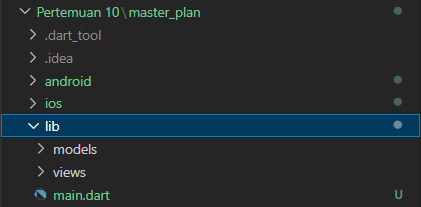

#### **Langkah 2: Membuat model task.dart**
Membuat file bernama task.dart dan buat class Task. Class ini memiliki atribut description dengan tipe data String dan complete dengan tipe data Boolean.

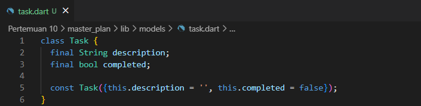

#### **Langkah 3: Buat file plan.dart**
Membuat file plan.dart untuk menyimpan daftar rencana dalam aplikasi to-do.

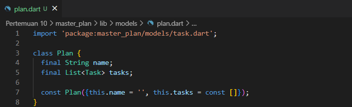

#### **Langkah 4: Buat file data_layer.dart**
Membuat file data_layer.dart untuk menyimpan data yang akan digunakan dalam aplikasi. untuk membungkus beberapa data layer ke dalam sebuah file yang nanti akan mengekspor kedua model tersebut.

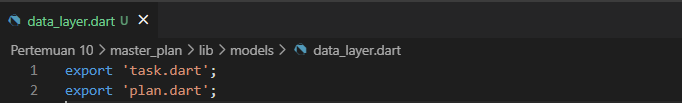

#### **Langkah 5: Pindah ke file main.dart**
Mengubah isi main.dart

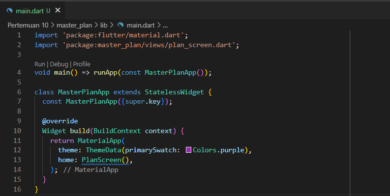

#### **Langkah 6: buat plan_screen.dart**
Membuat sebuah file plan_screen.dart pada folder views, dan gunakan template StatefulWidget untuk membuat class PlanScreen

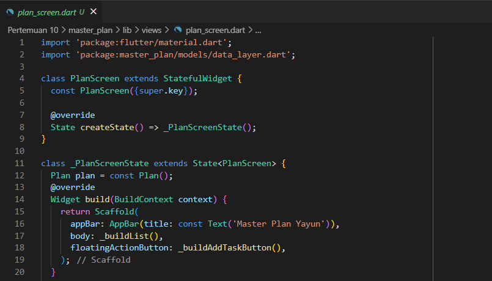

#### **Langkah 7: buat method _buildAddTaskButton()**
Membuat method _buildAddTaskButton() untuk membuat tombol tambah task.

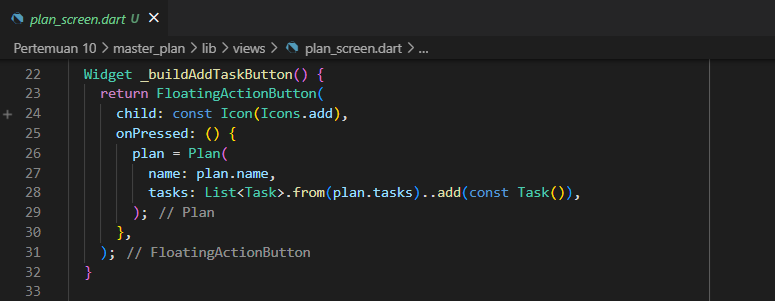

#### **Langkah 8: buat widget _buildList()**
Membuat widget _buildList() untuk membuat list task

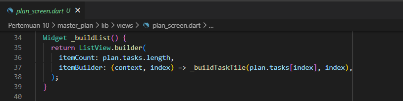

#### **Langkah 9: buat widget _buildTaskTile**
Membuat widget _buildTaskTile untuk membuat tile task.

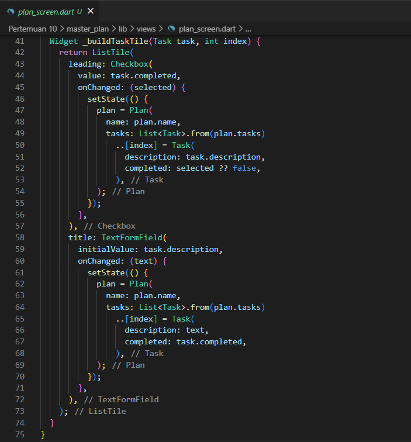

#### **Langkah 10: Tambah Scroll Controller**
Pada file plan_screen.dart, tambahkan variabel scroll controller di class State tepat setelah variabel plan

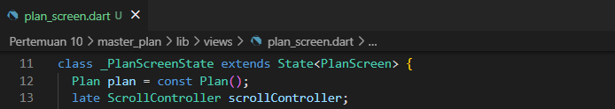

#### **Langkah 11: Tambah Scroll Listener**
Tambahkan method initState() setelah deklarasi variabel scrollController.

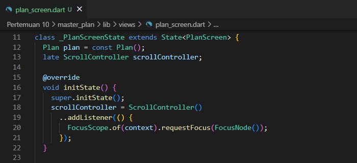

#### **Langkah 12: Tambah controller dan keyboard behavior**
Tambahkan controller dan keyboard behavior pada ListView di method _buildList.

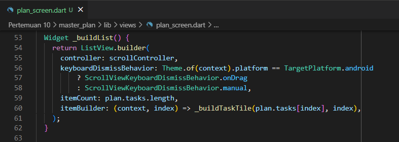

#### **Langkah 13: Terakhir, tambah method dispose()**
Tambahkan method dispose() di class PlanScreenState untuk membersihkan scroll controller.

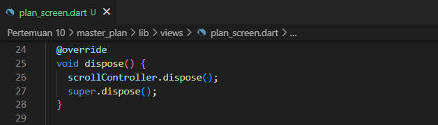

#### **Hasil**

## **Tugas Praktikum 1: Dasar State dengan Model-View**

-----
1. Selesaikan langkah-langkah praktikum tersebut, lalu dokumentasikan berupa GIF hasil akhir praktikum beserta penjelasannya di file README.md! Jika Anda menemukan ada yang error atau tidak berjalan dengan baik, silakan diperbaiki.
2. Jelaskan maksud dari langkah 4 pada praktikum tersebut! Mengapa dilakukan demikian?
3. Mengapa perlu variabel plan di langkah 6 pada praktikum tersebut? Mengapa dibuat konstanta ?
4. Lakukan capture hasil dari Langkah 9 berupa GIF, kemudian jelaskan apa yang telah Anda buat!
5. Apa kegunaan method pada Langkah 11 dan 13 dalam lifecyle state ?

## **Jawaban**

-----
2. Langkah 4 pada praktikum tersebut dilakukan untuk membungkus beberapa data layer ke dalam sebuah file yang nanti akan mengekspor kedua model tersebut.

3. Variabel plan pada langkah 6 digunakan untuk menyimpan data yang akan digunakan dalam aplikasi. Variabel plan dibuat konstanta agar data yang disimpan tidak dapat diubah.

4. Dalam kode program saya membuat widget _buildTaskTile untuk membuat tile task.

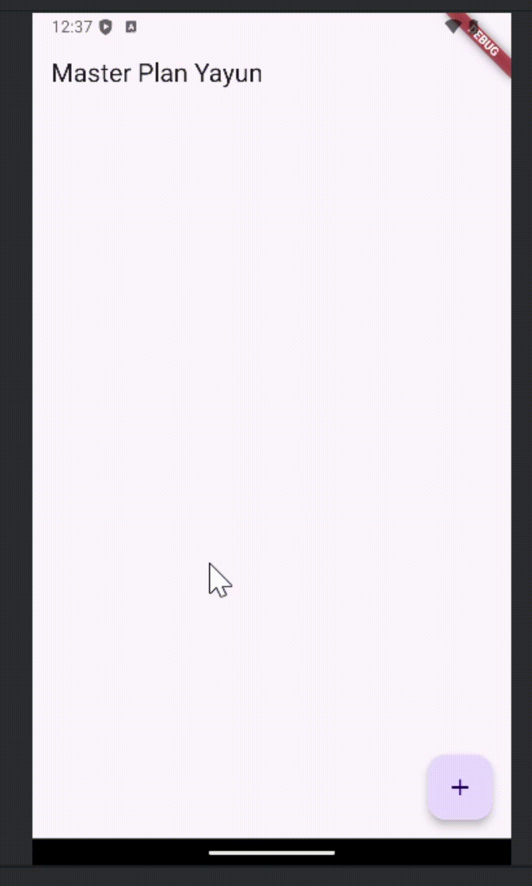

5. Pada langkah 11 method digunakan untuk menambahkan listener pada scroll controller, sedangkan method pada langkah 13 digunakan untuk membersihkan scroll controller.