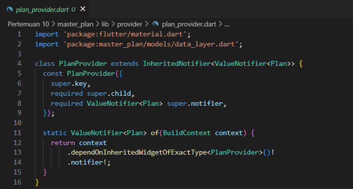
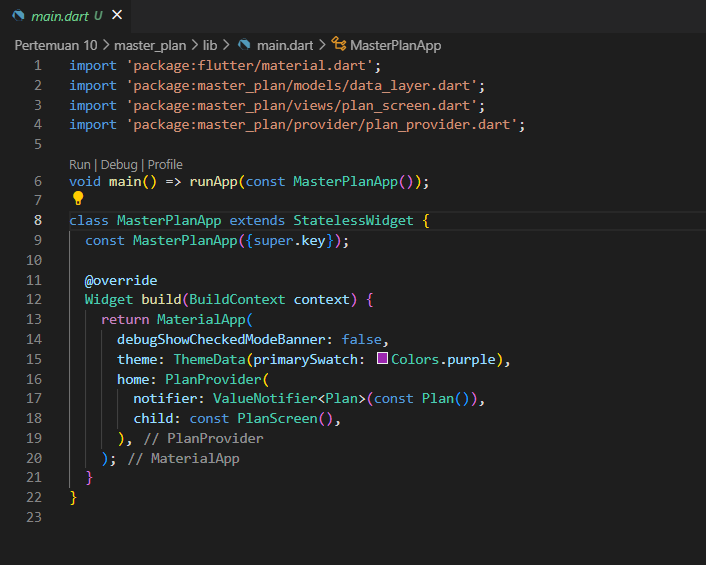
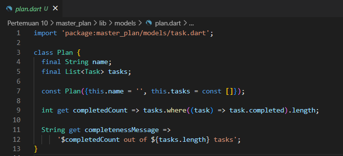
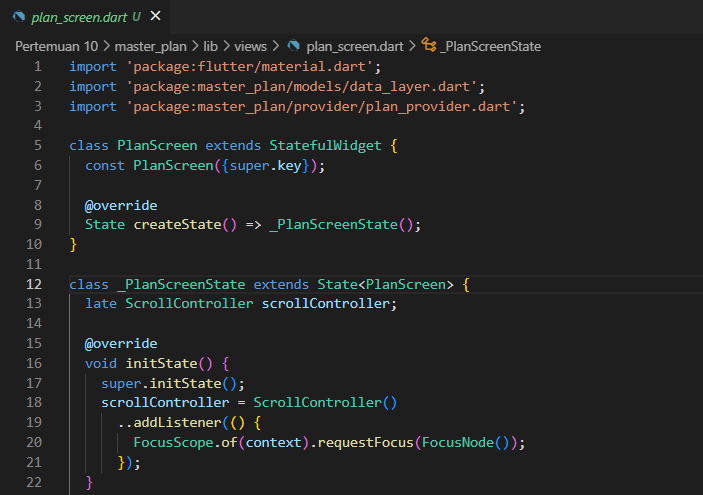
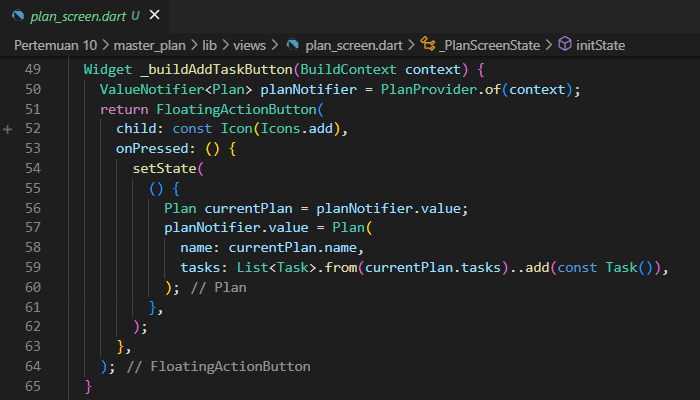
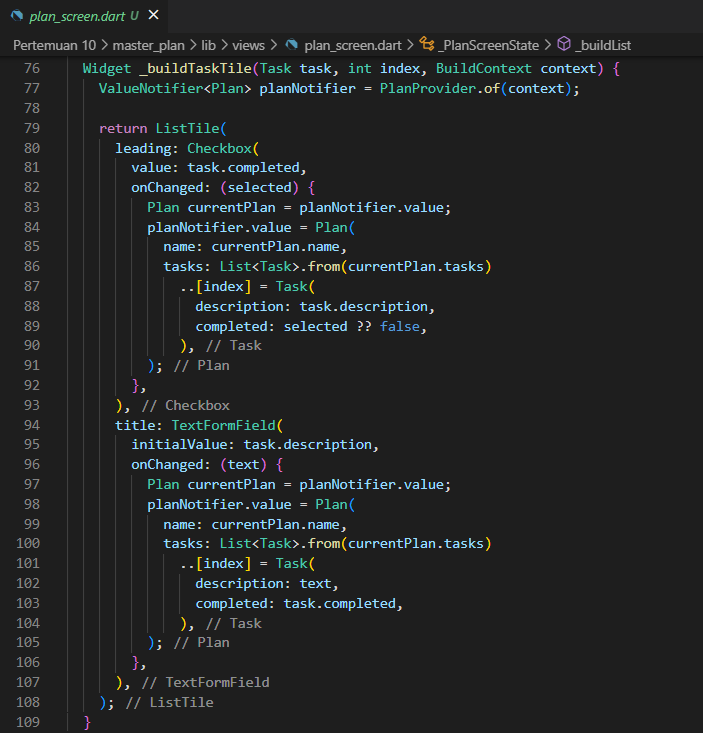
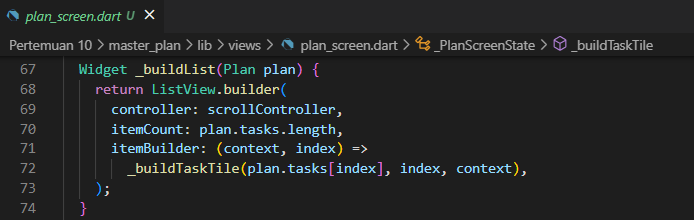
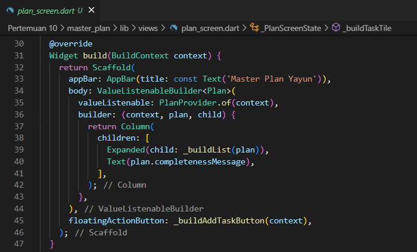
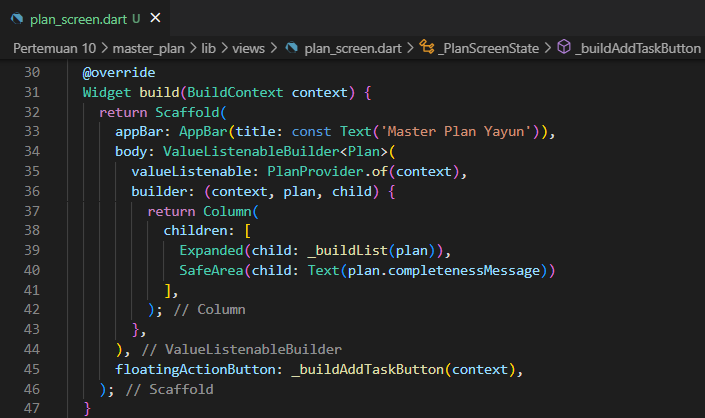
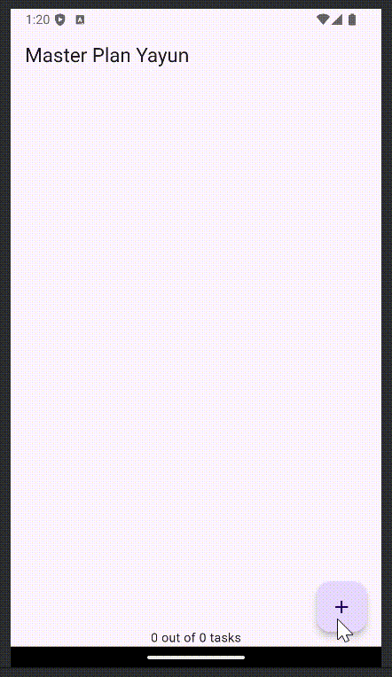

<table>
    <thead>
        <th style="text-align: center;" colspan="2">Pertemuan 10</th>
    </thead>
    <tbody>
        <tr>
            <td>Nama :</td>
            <td>Yayun Eldina</td>
        </tr>
        <tr>
            <td>Nim :</td>
            <td>2241720065</td>
        </tr>
    </tbody>
</table>

**********
# *Jobsheet 10 - Dasar State Management*
***********

## **Praktikum 2: Mengelola Data Layer dengan InheritedWidget dan InheritedNotifier**

-----

#### **Langkah 1: Buat file plan_provider.dart**
Membuat folder providers dan file plan_provider.dart. File ini akan berisi class PlanProvider yang meng-extend dari ChangeNotifier.

#### **Langkah 2: Edit main.dart**
Mengubah main.dart

#### **Langkah 3: Tambah method pada model plan.dart**
Menambahkan method completedCount dan completenessMessage pada class Plan.

#### **Langkah 4: Pindah ke PlanScreen**
Hapus deklarasi variabel plan

#### **Langkah 5: Edit method _buildAddTaskButton**
Tambahkan BuildContext sebagai parameter dan gunakan PlanProvider sebagai sumber datanya.

#### **Langkah 6: Edit method _buildTaskTile**
Tambahkan parameter BuildContext, gunakan PlanProvider sebagai sumber data. Ganti TextField menjadi TextFormField untuk membuat inisial data provider menjadi lebih mudah.

#### **Langkah 7: Edit _buildList**
Sesuaikan parameter pada bagian _buildTaskTile

#### **Langkah 8: Tetap di class PlanScreen**
Edit method build sehingga bisa tampil progress pada bagian bawah (footer).

#### **Langkah 9: Tambah widget SafeArea**
Tambahkan widget SafeArea pada method build

#### **Hasil**

## **Tugas Praktikum 2: InheritedWidget**

-----
1. Selesaikan langkah-langkah praktikum tersebut, lalu dokumentasikan berupa GIF hasil akhir praktikum beserta penjelasannya di file README.md! Jika Anda menemukan ada yang error atau tidak berjalan dengan baik, silakan diperbaiki sesuai dengan tujuan aplikasi tersebut dibuat.
2. Jelaskan mana yang dimaksud InheritedWidget pada langkah 1 tersebut! Mengapa yang digunakan InheritedNotifier?
3. Jelaskan maksud dari method di langkah 3 pada praktikum tersebut! Mengapa dilakukan demikian?
4. Lakukan capture hasil dari Langkah 9 berupa GIF, kemudian jelaskan apa yang telah Anda buat!

## **Jawaban**

-----

2. Pada langkah 1 inheritedWidget digunakan untuk membagikan data ke dalam widget-tree. InheritedNotifier digunakan karena InheritedNotifier adalah turunan dari InheritedWidget yang memiliki kemampuan untuk memberitahukan widget yang menggunakan data tersebut untuk melakukan rebuild ketika data berubah.

3. Pada langkah 3 method digunakan untuk menghitung jumlah task yang sudah selesai dan menampilkan pesan berdasarkan jumlah task yang sudah selesai.

4. Pada method build saya menambahkan widget SafeArea. SafeArea digunakan untuk memberikan padding pada aplikasi agar tidak terlalu dekat dengan tepi layar.

