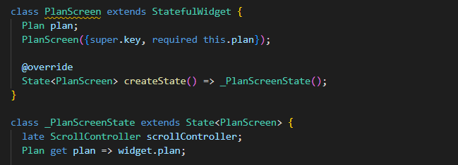

<table>
    <thead>
        <th style="text-align: center;" colspan="2">Pertemuan 10</th>
    </thead>
    <tbody>
        <tr>
            <td>Nama :</td>
            <td>Yayun Eldina</td>
        </tr>
        <tr>
            <td>Nim :</td>
            <td>2241720065</td>
        </tr>
    </tbody>
</table>

**********
# *Jobsheet 10 - Dasar State Management*
***********

## **Praktikum 3: Membuat State di Multiple Screens**

-----

#### **Langkah 1: Edit PlanProvider**
Edit class PlanProvider sehingga dapat menangani List Plan.

#### **Langkah 2: Edit main.dart**
Mengubah main.dart

#### **Langkah 3: Edit plan_screen.dart**
Tambahkan variabel plan dan atribut pada constructor-nya.

#### **Langkah 4: Error**
Akan terjadi error setiap kali memanggil PlanProvider.of(context). Itu terjadi karena screen saat ini hanya menerima tugas-tugas untuk satu kelompok Plan, tapi sekarang PlanProvider menjadi list dari objek plan tersebut.

#### **Langkah 5: Tambah getter Plan**
Tambahkan getter pada _PlanScreenState

#### **Langkah 6: Method initState()**

#### **Langkah 7: Widget build**
Merubah ke List dan mengubah nilai pada currentPlan.

#### **Langkah 8: Edit _buildTaskTile**
Ubah ke List dan variabel planNotifier.

#### **Langkah 9: Buat screen baru**
Membuat file baru dengan nama plan_creator_screen.dart di folder view, dan deklarasikan dengan StatefulWidget bernama PlanCreatorScreen.

#### **Langkah 10: Pindah ke class _PlanCreatorScreenState**
Menambahkab variabel TextEditingController sehingga bisa membuat TextField sederhana untuk menambah Plan baru dan menambahkan dispose ketika widget unmounted

#### **Langkah 11: Pindah ke method build**
Menambahkan Widget Scaffold

#### **Langkah 12: Buat widget _buildListCreator**
Membuat widget _buildListCreator

#### **Langkah 13: Buat void addPlan()**
Membuat void addPlan() untuk menambahkan Plan baru

#### **Langkah 14: Buat widget _buildMasterPlans()**
Membuat widget _buildMasterPlans

#### **Hasil**

## **Tugas Praktikum 3: State di Multiple Screens**

-----
1. Selesaikan langkah-langkah praktikum tersebut, lalu dokumentasikan berupa GIF hasil akhir praktikum beserta penjelasannya di file README.md! Jika Anda menemukan ada yang error atau tidak berjalan dengan baik, silakan diperbaiki sesuai dengan tujuan aplikasi tersebut dibuat.
2. Berdasarkan Praktikum 3 yang telah Anda lakukan, jelaskan maksud dari gambar diagram berikut ini!
gambar
3. Lakukan capture hasil dari Langkah 14 berupa GIF, kemudian jelaskan apa yang telah Anda buat!

## **Jawaban**

-----
2. Navigator.push digunakan untuk memindahkan pengguna dari PlanCreatorScreen (kiri) ke PlanScreen (kanan). Perpindahan ini mengubah tampilan dari layar input menjadi tampilan daftar atau detail rencana.

3. Saya membuat widget _buildMasterPlans untuk membuat list rencana yang sudah dibuat.

