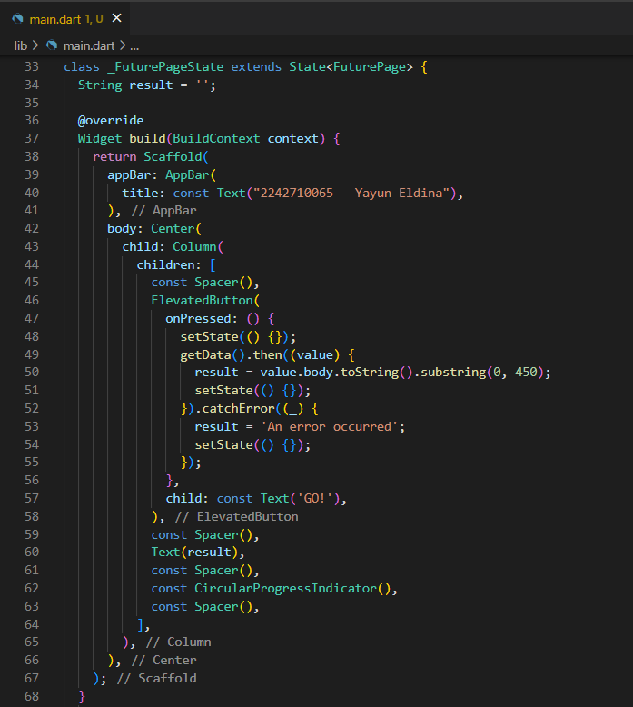

<table>
    <thead>
        <th style="text-align: center;" colspan="2">Pertemuan 11</th>
    </thead>
    <tbody>
        <tr>
            <td>Nama :</td>
            <td>Yayun Eldina</td>
        </tr>
        <tr>
            <td>Nim :</td>
            <td>2241720065</td>
        </tr>
    </tbody>
</table>

**********
# *Jobsheet 11 - Pemrograman Asynchronous*
***********

## **Praktikum 1: Mengunduh Data dari Web Service (API)**

-----

#### **Langkah 1: Buat Project Baru**
Buatlah sebuah project flutter baru dengan nama books di folder src week-11 repository GitHub Anda. 

Kemudian Tambahkan dependensi http dengan mengetik perintah berikut di terminal.

#### **Langkah 2: Cek file pubspec.yaml**
Langkah 2: Cek file pubspec.yaml

#### **Langkah 3: Buka file main.dart**
Ketiklah kode seperti berikut ini.

#### **Langkah 4: Tambah method getData()**
Tambahkan method ini ke dalam class _FuturePageState yang berguna untuk mengambil data dari API Google Books.

#### **Langkah 5: Tambah kode di ElevatedButton**
Tambahkan kode pada onPressed di ElevatedButton seperti berikut.

#### **Hasil**

## **Soal 1**

-----
1. Tambahkan nama panggilan Anda pada title app sebagai identitas hasil pekerjaan Anda.

## **Soal 2**

-----

2. - Carilah judul buku favorit Anda di Google Books, lalu ganti ID buku pada variabel path di kode tersebut. Caranya ambil di URL browser Anda seperti gambar berikut ini.

- Kemudian cobalah akses di browser URI tersebut dengan lengkap seperti ini. Jika menampilkan data JSON, maka Anda telah berhasil. Lakukan capture milik Anda dan tulis di README pada laporan praktikum. Lalu lakukan commit dengan pesan "W11: Soal 2".

## **Soal 3**

-----

#### **Penjelasan**
- **substring** :
Membatasi teks yang diambil dari data respons hingga panjang 450 karakter.
- **catchError**:
Menangkap error dari operasi getData() dan menangani error dengan mengatur pesan error pada variabel result.

