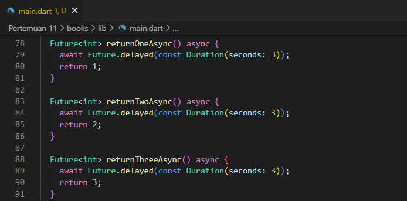

<table>
    <thead>
        <th style="text-align: center;" colspan="2">Pertemuan 11</th>
    </thead>
    <tbody>
        <tr>
            <td>Nama :</td>
            <td>Yayun Eldina</td>
        </tr>
        <tr>
            <td>Nim :</td>
            <td>2241720065</td>
        </tr>
    </tbody>
</table>

**********
# *Jobsheet 11 - Pemrograman Asynchronous*
***********

## **Praktikum 2: Menggunakan await/async untuk menghindari callbacks**

-----

#### **Langkah 1: Buka file main.dart**
Tambahkan tiga method berisi kode seperti berikut di dalam class _FuturePageState.

#### **Langkah 2: Tambah method count()**
Lalu tambahkan lagi method ini di bawah ketiga method sebelumnya.

#### **Langkah 3: Panggil count()**
Lakukan comment kode sebelumnya, ubah isi kode onPressed() menjadi seperti berikut

#### **Langkah 4: Run**
Akhirnya, run atau tekan F5 jika aplikasi belum running. Maka Anda akan melihat seperti gambar berikut, hasil angka 6 akan tampil setelah delay 9 detik.

## **Soal 4**

-----

#### **Penjelasan**
- Langkah 1: Membuat tiga fungsi asinkron untuk mensimulasikan penundaan dan mengembalikan nilai tertentu.
- Langkah 2: Membuat metode `count()` untuk menghitung total hasil dari ketiga fungsi tersebut secara berurutan, lalu memperbarui tampilan UI dengan hasilnya.

