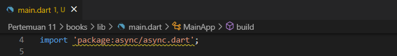
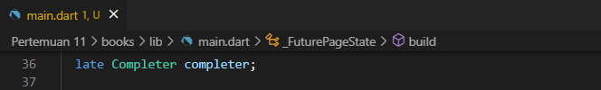
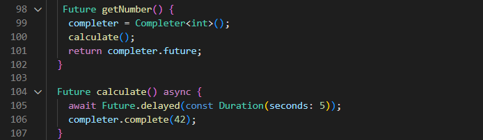
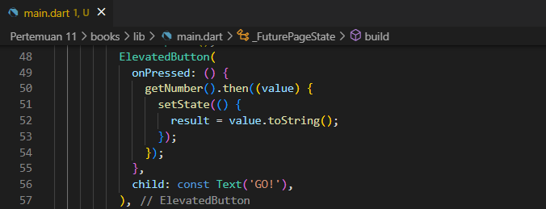
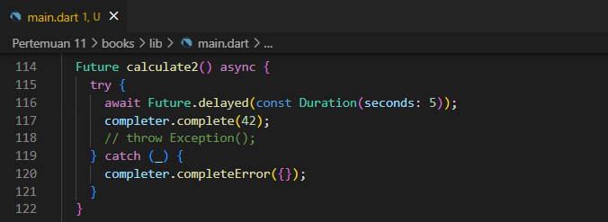
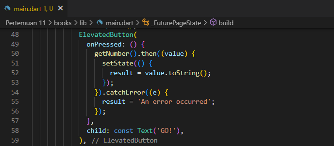
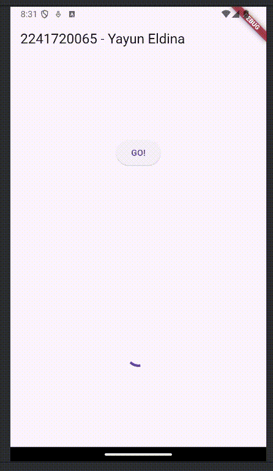

<table>
    <thead>
        <th style="text-align: center;" colspan="2">Pertemuan 11</th>
    </thead>
    <tbody>
        <tr>
            <td>Nama :</td>
            <td>Yayun Eldina</td>
        </tr>
        <tr>
            <td>Nim :</td>
            <td>2241720065</td>
        </tr>
    </tbody>
</table>

**********
# *Jobsheet 11 - Pemrograman Asynchronous*
***********

## **Praktikum 3: Menggunakan Completer di Future**

-----

#### **Langkah 1: Buka main.dart**
Pastikan telah impor package async berikut.

#### **Langkah 2: Tambahkan variabel dan method**
Tambahkan variabel late dan method di class _FuturePageState seperti ini.

#### **Langkah 3: Ganti isi kode onPressed()**
Tambahkan kode berikut pada fungsi onPressed(). Kode sebelumnya bisa Anda comment.

#### **Langkah 4: Run**

#### **Langkah 5: Ganti method calculate()**
Gantilah isi code method calculate() seperti kode berikut, atau Anda dapat membuat calculate2()

#### **Langkah 6: Pindah ke onPressed()**
Ganti menjadi kode seperti berikut.

## **Soal 5**

-----
Jelaskan maksud kode langkah 2 tersebut!
- **Jawab**
Kode tersebut menggunakan Completer untuk mengelola penyelesaian (completion) dari sebuah Future secara manual.

Mendeklarasikan variabel completer dengan keyword late, yang berarti variabel akan diinisialisasi nanti sebelum digunakan.

Fungsi getNumber() membuat instance baru dari Completer<int>(). Memanggil fungsi calculate() yang akan menyelesaikan Completer tersebut. Mengembalikan completer.future, yaitu sebuah Future yang akan berisi nilai ketika completer selesai (complete).

## **Soal 6**
Jelaskan maksud perbedaan kode langkah 2 dengan langkah 5-6 tersebut!
-----

## **Jawab**
Kode langkah 2 menggunakan Completer untuk mengelola penyelesaian (completion) dari sebuah Future secara manual tanpa melakukan handle jika terjadi error.

Sedangkan kode langkah 5-6 menggunakan Completer dengan Future.delayed untuk menunda eksekusi kode selama 5 detik dan menerapkan try-catch untuk menangkap error yang terjadi dan completer.completeError() untuk menyelesaikan Completer dengan error.

