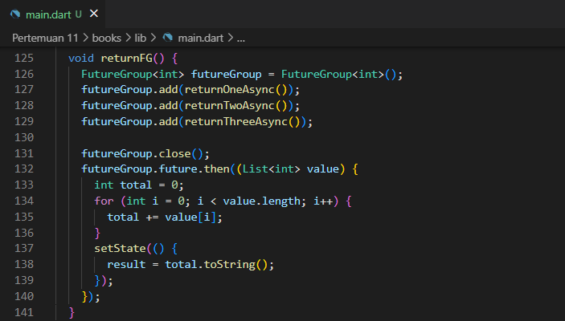
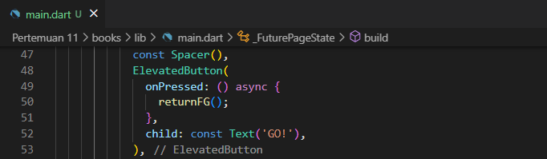
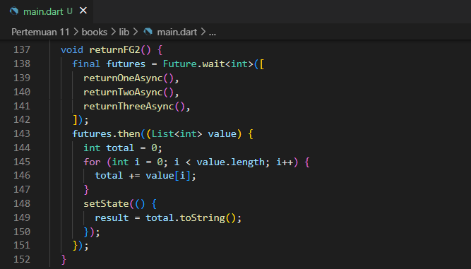

<table>
    <thead>
        <th style="text-align: center;" colspan="2">Pertemuan 11</th>
    </thead>
    <tbody>
        <tr>
            <td>Nama :</td>
            <td>Yayun Eldina</td>
        </tr>
        <tr>
            <td>Nim :</td>
            <td>2241720065</td>
        </tr>
    </tbody>
</table>

**********
# *Jobsheet 11 - Pemrograman Asynchronous*
***********

## **Praktikum 4: Memanggil Future secara paralel**

-----

#### **Langkah 1: Buka main.dart**
Menambahkan method returnFG ke dalam class _FuturePageState.

#### **Langkah 2: Edit onPressed()**
Mengedit kode onPressed() pada ElevatedButton.

#### **Langkah 3: Run**
Hasilnya dalam 3 detik berupa angka 6 lebih cepat dibandingkan praktikum sebelumnya menunggu sampai 9 detik.

## **Soal 7**
Capture hasil praktikum Anda berupa GIF dan lampirkan di README
-----

## **Jawab**

#### **Langkah 4: Ganti variabel futureGroup**
Mengganti variabel futureGroup dengan Future.wait.

## **Soal 8**
Jelaskan maksud perbedaan kode langkah 1 dan 4!
-----

## **Jawab**
Kode langkah 1 menggunakan FutureGroup untuk mengelola beberapa Future secara paralel. Sedangkan kode langkah 4 menggunakan Future.wait untuk menjalankan beberapa Future secara paralel dan mengembalikan Future yang akan menyelesaikan ketika semua Future selesai.

Keduanya digunakan untuk menunggu beberapa Future selesai, tetapi FutureGroup memberikan fleksibilitas lebih dalam menambahkan Future secara dinamis

