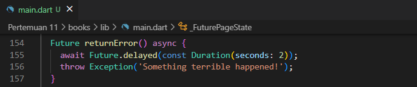
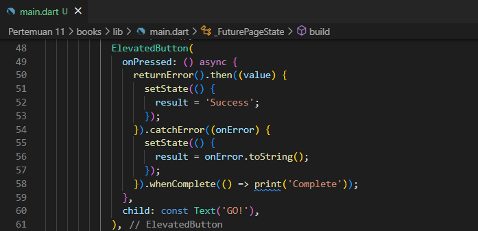
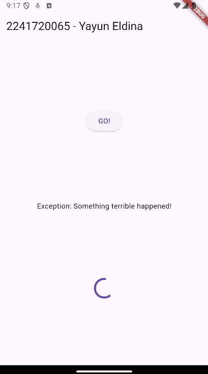
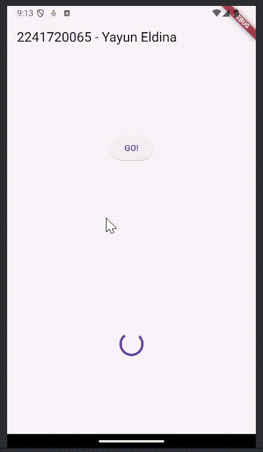
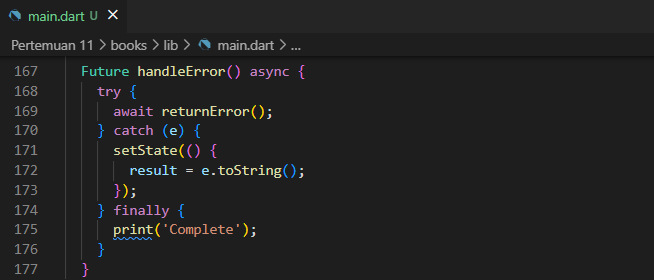

<table>
    <thead>
        <th style="text-align: center;" colspan="2">Pertemuan 11</th>
    </thead>
    <tbody>
        <tr>
            <td>Nama :</td>
            <td>Yayun Eldina</td>
        </tr>
        <tr>
            <td>Nim :</td>
            <td>2241720065</td>
        </tr>
    </tbody>
</table>

**********
# *Jobsheet 11 - Pemrograman Asynchronous*
***********

## **Praktikum 5: Menangani Respon Error pada Async Code**

-----

#### **Langkah 1: Buka file main.dart**
Menambahkan method returnError ke dalam class _FuturePageState.

#### **Langkah 2: ElevatedButton**
Ubah kode onPressed() pada ElevatedButton.

#### **Langkah 3: Run**
Menjalankan aplikasi

## **Soal 9**
#### Capture hasil praktikum Anda berupa GIF dan lampirkan di README.
-----

## **Jawab**

#### **Langkah 4: Tambah method handleError()**
Menambahkan method handleError ke dalam class _FuturePageState.

## **Soal 9**
#### Panggil method handleError() tersebut di ElevatedButton, lalu run. Apa hasilnya? Jelaskan perbedaan kode langkah 1 dan 4!
-----

## **Jawab**
Hasilnya akan menampilkan complete pada console. Perbedaan kode langkah 1 dan 4 adalah kode langkah 1 menggunakan catchError untuk menangkap error yang terjadi pada kode dan onComplete untuk menampilkan hasilnya di console. Sedangkan kode langkah 4 menggunakan try-catch pada method returnError untuk menangkap error yang terjadi dan menggunakan finally untuk menampilkan hasilnya di console.

