<table>
    <thead>
        <th style="text-align: center;" colspan="2">Pertemuan 11</th>
    </thead>
    <tbody>
        <tr>
            <td>Nama :</td>
            <td>Yayun Eldina</td>
        </tr>
        <tr>
            <td>Nim :</td>
            <td>2241720065</td>
        </tr>
    </tbody>
</table>

**********
# *Jobsheet 11 - Pemrograman Asynchronous*
***********

## **Praktikum 6: Menggunakan Future dengan StatefulWidget**

-----

#### **Langkah 1: install plugin geolocator**
Menambahkan dependencies geolocator.

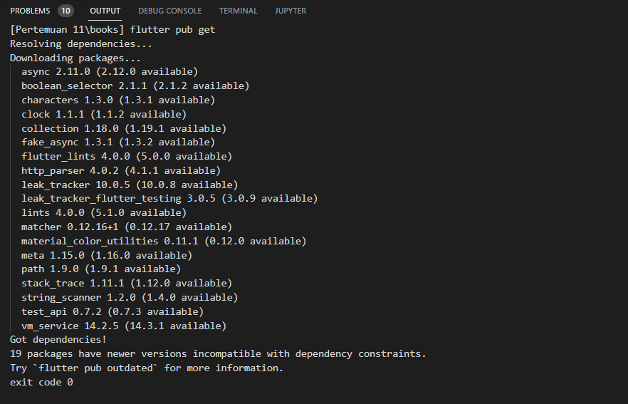

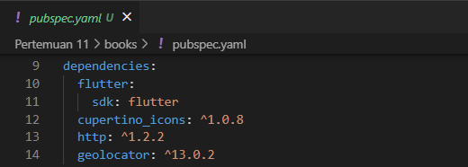

#### **Langkah 2: Tambah permission GPS**
Menambahkan permission GPS.

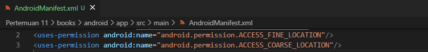

#### **Langkah 3: Buat file geolocation.dart**
Membuat file geolocation.dart.

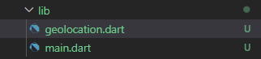

#### **Langkah 4: Buat StatefulWidget**
Buat class LocationScreen di dalam file geolocation.dart.

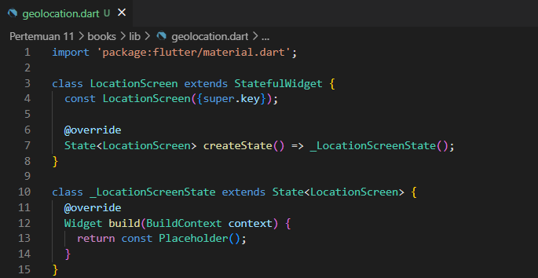

#### **Langkah 5: Isi kode geolocation.dart**
Isi kode di dalam class LocationScreen.

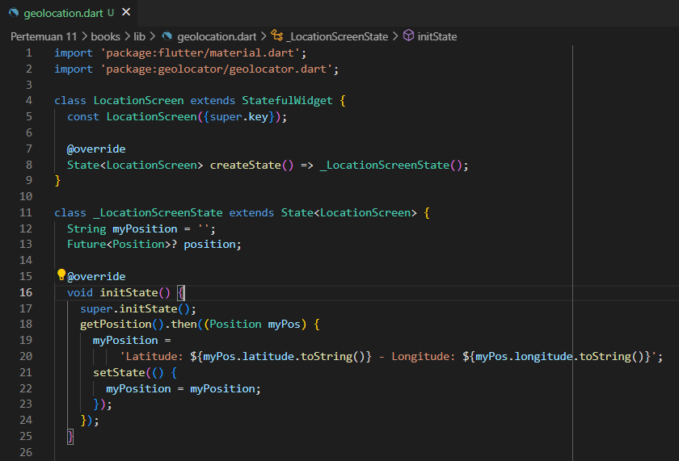

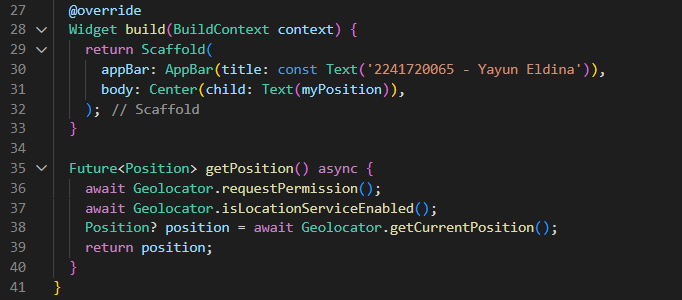

## **Soal 11**
#### Tambahkan nama panggilan Anda pada tiap properti title sebagai identitas pekerjaan Anda.
-----

## **Jawab**

#### **Langkah 6: Edit main.dart**
Panggil screen baru tersebut di file main.dart.

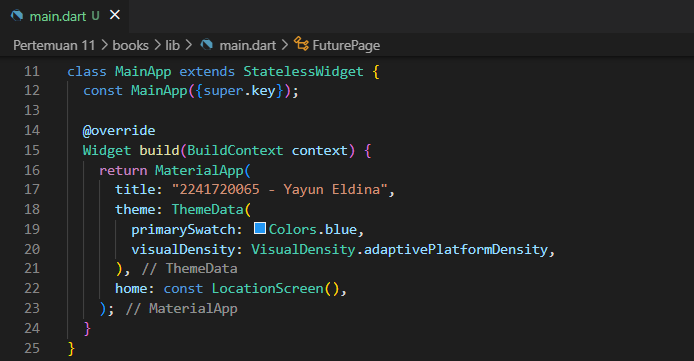

#### **Langkah 7: Run**
Menjalankan aplikasi.

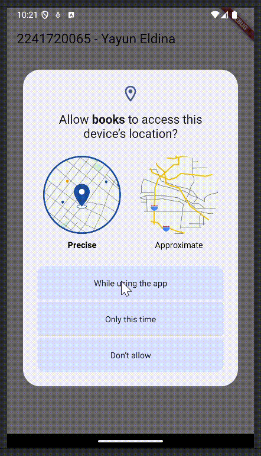

#### **Langkah 8: Tambahkan animasi loading**
Menambahkan animasi loading.

## **Soal 12**
#### Jika Anda tidak melihat animasi loading tampil, kemungkinan itu berjalan sangat cepat. Tambahkan delay pada method getPosition() dengan kode await Future.delayed(const Duration(seconds: 3));

#### Apakah Anda mendapatkan koordinat GPS ketika run di browser? Mengapa demikian?

#### Capture hasil praktikum Anda berupa GIF dan lampirkan di README.
-----

## **Jawab**
Menambahkan delay pada method getPosition() dengan kode await Future.delayed(const Duration(seconds: 3));.

Saya mendapatkan koordinat GPS ketika run di browser. Hal ini dikarenakan browser memiliki akses ke GPS sehingga dapat menampilkan koordinat GPS.

Hasil run di browser.

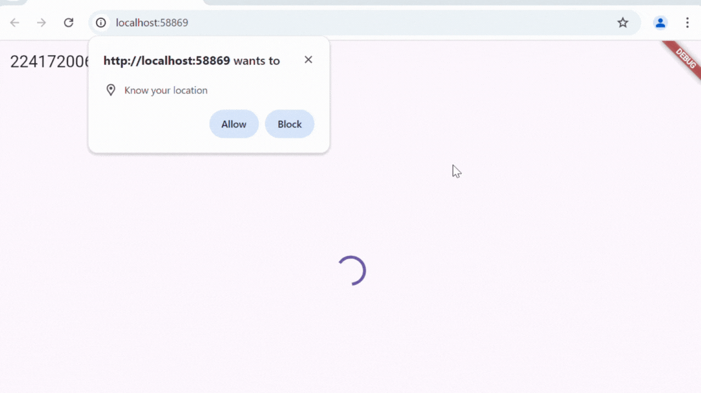

Hasil run di device.

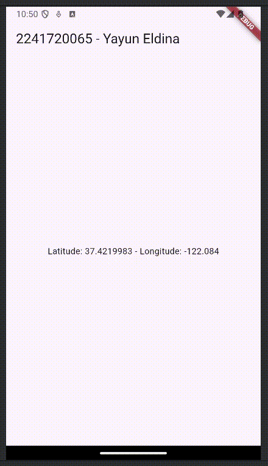