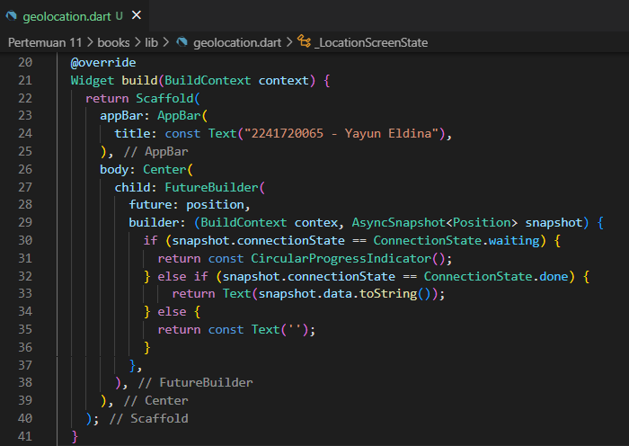

<table>
    <thead>
        <th style="text-align: center;" colspan="2">Pertemuan 11</th>
    </thead>
    <tbody>
        <tr>
            <td>Nama :</td>
            <td>Yayun Eldina</td>
        </tr>
        <tr>
            <td>Nim :</td>
            <td>2241720065</td>
        </tr>
    </tbody>
</table>

**********
# *Jobsheet 11 - Pemrograman Asynchronous*
***********

## **Praktikum 7: Manajemen Future dengan FutureBuilder**

-----

#### **Langkah 1: Modifikasi method getPosition()**
Menambahkan kode await Future.delayed(const Duration(seconds: 3)); pada method getPosition().

#### **Langkah 2: Tambah variabel**
Menambahkan variabel position di class _LocationScreenState.

#### **Langkah 3: Tambah initState()**
Set variabel position pada initState().

#### **Langkah 4: Edit method build()**
Mengedit method build().

## **Soal 13**
#### Apakah ada perbedaan UI dengan praktikum sebelumnya? Mengapa demikian?

#### Capture hasil praktikum Anda berupa GIF dan lampirkan di README.
-----

## **Jawab**
Tidak, tidak ada perbedaan UI dengan praktikum sebelumnya. Hal ini dikarenakan menggunakan FutureBuilder yang akan menampilkan widget sesuai dengan status Future.

#### **Langkah 5: Tambah handling error**
Menambahkan handling error.

## **Soal 14**
#### Apakah ada perbedaan UI dengan langkah sebelumnya? Mengapa demikian?

#### Capture hasil praktikum Anda berupa GIF dan lampirkan di README.
-----

## **Jawab**
Tidak, tidak ada perbedaan UI dengan langkah sebelumnya. Hal ini dikarenakan menggunakan FutureBuilder yang akan menampilkan widget sesuai dengan status Future dan menambahkan handle error jika terjadi error.

