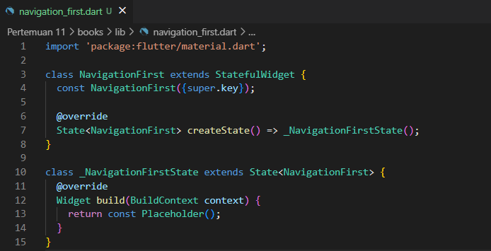
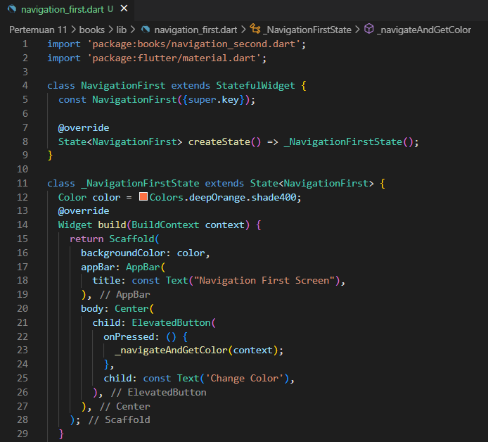
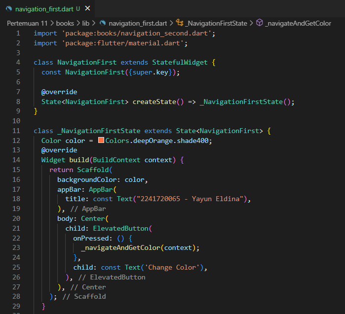
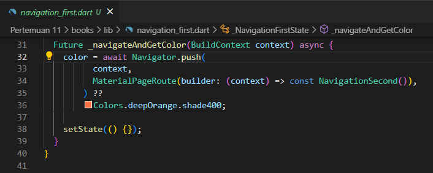
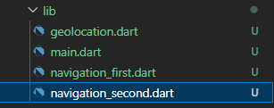
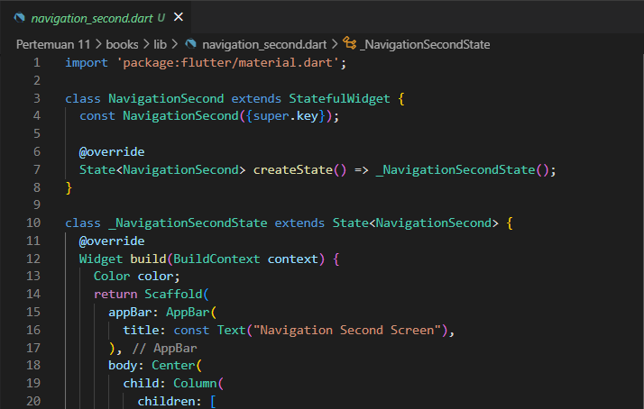
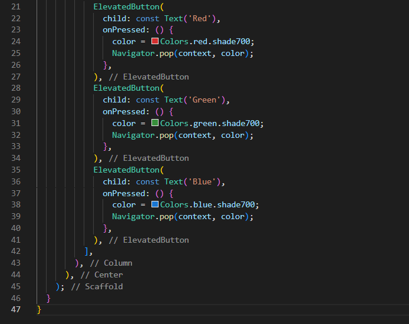
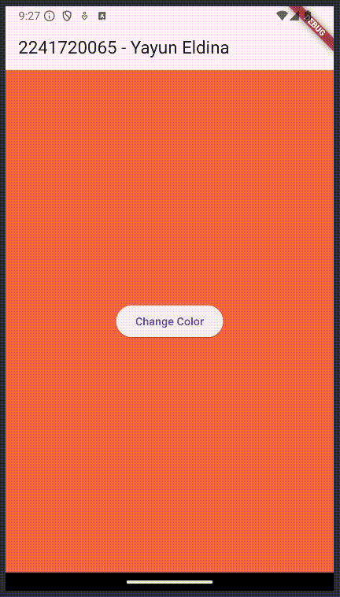

<table>
    <thead>
        <th style="text-align: center;" colspan="2">Pertemuan 11</th>
    </thead>
    <tbody>
        <tr>
            <td>Nama :</td>
            <td>Yayun Eldina</td>
        </tr>
        <tr>
            <td>Nim :</td>
            <td>2241720065</td>
        </tr>
    </tbody>
</table>

**********
# *Jobsheet 11 - Pemrograman Asynchronous*
***********

## **Praktikum 8: Navigation route dengan Future Function**

-----

#### **Langkah 1: Buat file baru navigation_first.dart**
Membuat file navigation_first.dart.

#### **Langkah 2: Isi kode navigation_first.dart**
Isi kode di dalam class NavigationFirstScreen.

## **Soal 15**
#### Tambahkan nama panggilan Anda pada tiap properti title sebagai identitas pekerjaan Anda.
#### Silakan ganti dengan warna tema favorit Anda.
-----

## **Jawab**
Mengubah title dengan nama panggilan dan mengubah warna tema menjadi warna oranye.

#### **Langkah 3: Tambah method di class _NavigationFirstState**
Menambahkan method _navigateAndGetColor di dalam class _NavigationFirstState.

#### **Langkah 4: Buat file baru navigation_second.dart**
Membuat file navigation_second.dart.

#### **Langkah 5: Buat class NavigationSecond dengan StatefulWidget**
Membuat class NavigationSecond dengan StatefulWidget.

#### **Langkah 6: Edit main.dart**
Lakukan edit properti home.

#### **Langkah 7: Run**
Menjalankan aplikasi.

## **Soal 16**
#### Cobalah klik setiap button, apa yang terjadi ? Mengapa demikian ?
#### Capture hasil praktikum Anda berupa GIF dan lampirkan di README.
-----

## **Jawab**
Ketika button change color diklik, maka akan menampilkan halaman kedua, di halaman kedua terdapat 3 button yang masing-masing akan mengubah warna background pada halaman pertama.

Hasil run aplikasi.

