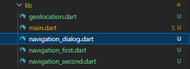
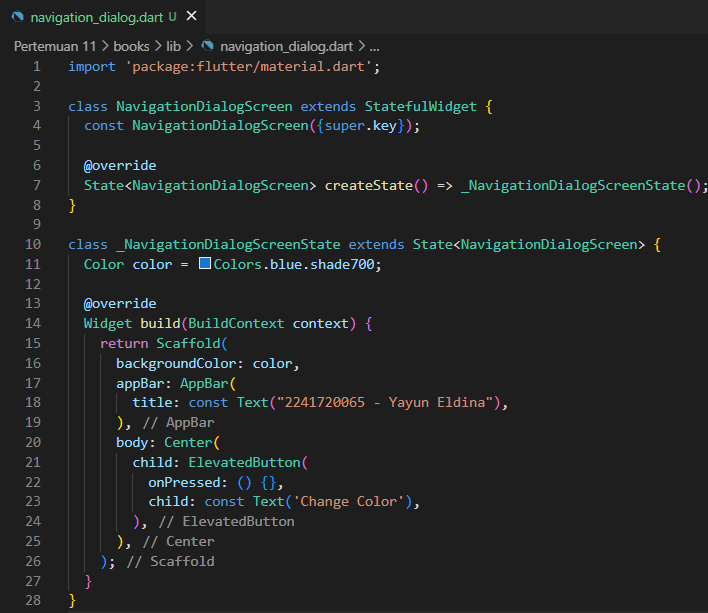
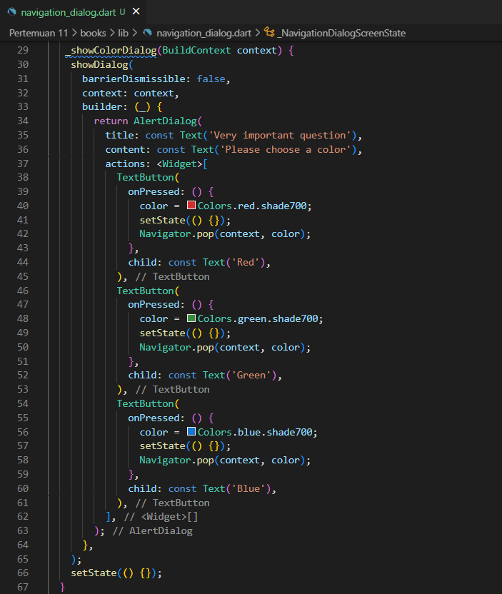
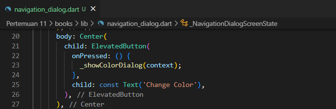
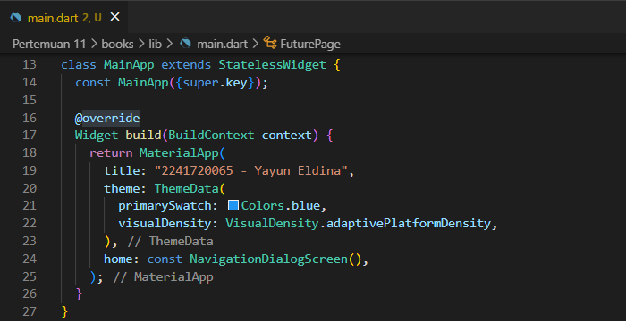
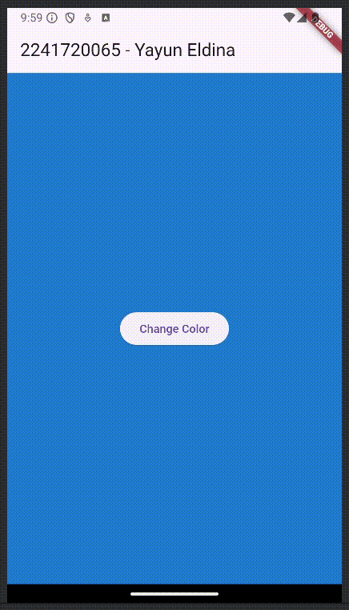
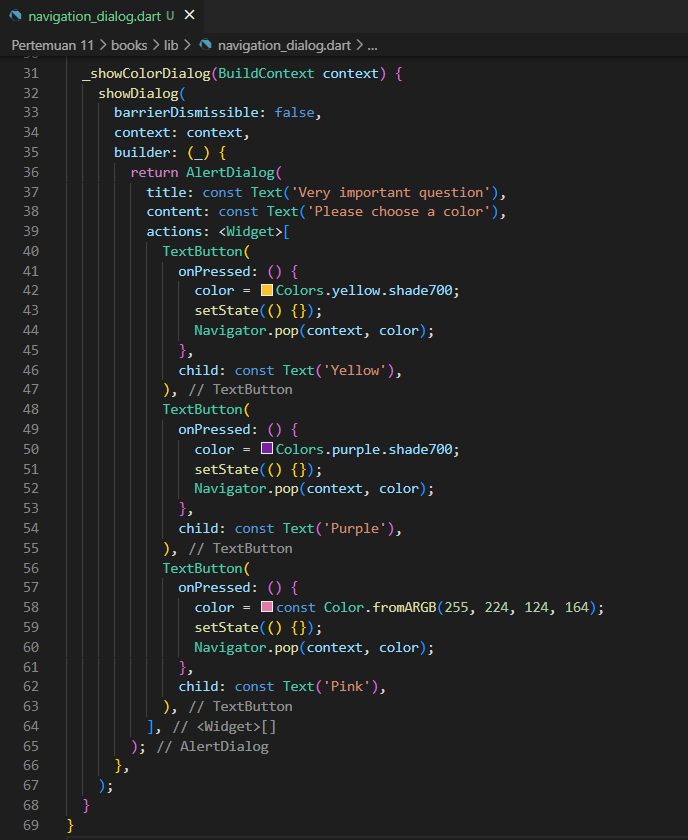
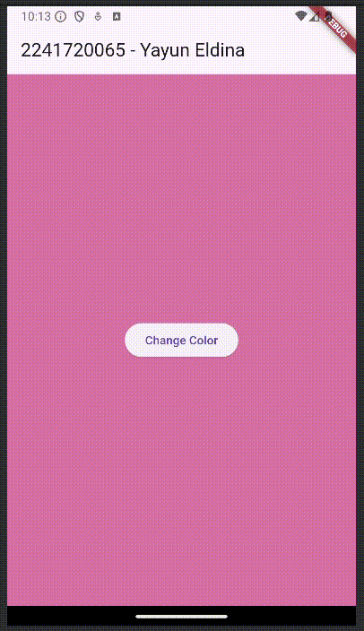

<table>
    <thead>
        <th style="text-align: center;" colspan="2">Pertemuan 11</th>
    </thead>
    <tbody>
        <tr>
            <td>Nama :</td>
            <td>Yayun Eldina</td>
        </tr>
        <tr>
            <td>Nim :</td>
            <td>2241720065</td>
        </tr>
    </tbody>
</table>

**********
# *Jobsheet 11 - Pemrograman Asynchronous*
***********

## **Praktikum 9: Memanfaatkan async/await dengan Widget Dialog**

-----

#### **Langkah 1: Buat file baru navigation_dialog.dart**
Membuat file navigation_dialog.dart.

#### **Langkah 2: Isi kode navigation_dialog.dart**
Menambahkan kode di dalam class NavigationDialogScreen.

#### **Langkah 3: Tambah method async**
Menambahkan method _showColorDialog dengan async.

#### **Langkah 4: Panggil method di ElevatedButton**
Panggil method _showColorDialog di ElevatedButton.

#### **Langkah 5: Edit main.dart**
Lakukan edit properti home

#### **Langkah 6: Run**
Menjalankan aplikasi.

## **Soal 17**
#### Cobalah klik setiap button, apa yang terjadi ? Mengapa demikian ?
#### Gantilah 3 warna pada langkah 3 dengan warna favorit Anda!
#### Capture hasil praktikum Anda berupa GIF dan lampirkan di README.

-----

#### **Jawab**
Ketika button change color diklik, maka akan menampilkan dialog yang berisi 3 button yang masing-masing akan mengubah warna background pada halaman pertama.

Mengganti warna menjadi warna favorit.

Hasil run aplikasi.

