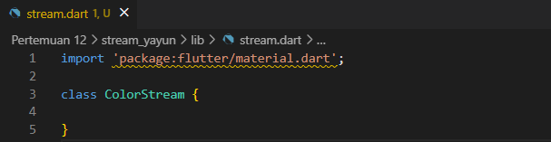
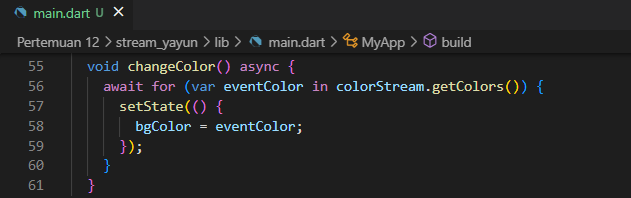
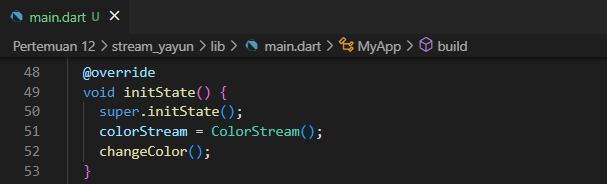
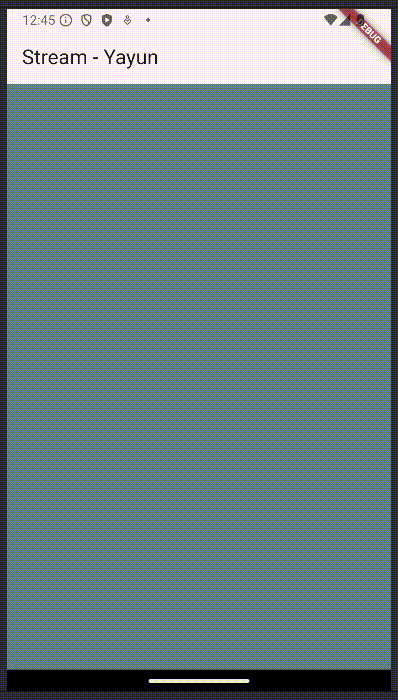

<table>
    <thead>
        <th style="text-align: center;" colspan="2">Pertemuan 12</th>
    </thead>
    <tbody>
        <tr>
            <td>Nama :</td>
            <td>Yayun Eldina</td>
        </tr>
        <tr>
            <td>Nim :</td>
            <td>2241720065</td>
        </tr>
    </tbody>
</table>

**********
# *Jobsheet 12 - Stream*
***********

## **Praktikum 1: Dart Streams**

-----

#### **Langkah 1: Buat Project Baru**
Buatlah sebuah project flutter baru dengan nama stream_nama (beri nama panggilan Anda) di folder week-12/src/ repository GitHub Anda. 

#### **Langkah 2: Buka file main.dart**
Ketiklah kode seperti berikut ini.

## **Soal 1**
#### - Tambahkan nama panggilan Anda pada title app sebagai identitas hasil pekerjaan Anda.
#### - Gantilah warna tema aplikasi sesuai kesukaan Anda
#### - Lakukan commit hasil jawaban Soal 1 dengan pesan "W12: Jawaban Soal 1"

-----

#### **Jawaban**
nama panggilan Anda pada title app sebagai identitas hasil pekerjaan Anda

warna tema aplikasi sesuai kesukaan

#### **Langkah 3: Buat file baru stream.dart**
Buat file baru di folder lib project Anda. Lalu isi dengan kode berikut.

#### **Langkah 4: Tambah variabel colors**
Tambahkan variabel di dalam class ColorStream seperti berikut.

## **Soal 2**
#### - Tambahkan 5 warna lainnya sesuai keinginan Anda pada variabel colors tersebut.
#### - Lakukan commit hasil jawaban Soal 2 dengan pesan "W12: Jawaban Soal 2"

-----

#### **Jawaban**

#### **Langkah 5: Tambah method getColors()**
Di dalam class ColorStream ketik method seperti kode berikut. Perhatikan tanda bintang di akhir keyword async* (ini digunakan untuk melakukan Stream data)

#### **Langkah 6: Tambah perintah yield***
Tambahkan kode berikut ini.

## **Soal 3**
#### - Jelaskan fungsi keyword yield* pada kode tersebut!
#### - Apa maksud isi perintah kode tersebut?
#### - Lakukan commit hasil jawaban Soal 3 dengan pesan "W12: Jawaban Soal 3"

-----

#### **Jawaban**
- Fungsi yield*: Forward semua nilai dari stream lain (Stream.periodic) ke stream utama tanpa memprosesnya satu per satu.

- Maksud perintah kode tersebut, untuk membuat stream yang setiap 1 detik mengeluarkan warna dari daftar colors secara bergantian dan melingkar.

#### **Langkah 7: Buka main.dart**
Ketik kode impor file ini pada file main.dart

#### **Langkah 8: Tambah variabel**
Ketik dua properti ini di dalam class _StreamHomePageState

#### **Langkah 9: Tambah method changeColor()**
Tetap di file main, Ketik kode seperti berikut

#### **Langkah 10: Lakukan override initState()**
Ketika kode seperti berikut

#### **Langkah 11: Ubah isi Scaffold()**
Sesuaikan kode seperti berikut.

#### **Langkah 12: Run**
Lakukan running pada aplikasi Flutter Anda, maka akan terlihat berubah warna background setiap detik.

## **Soal 4**
#### - Capture hasil praktikum Anda berupa GIF dan lampirkan di README.
#### - Lakukan commit hasil jawaban Soal 4 dengan pesan "W12: Jawaban Soal 4"

-----

#### **Jawaban**

#### **Langkah 13: Ganti isi method changeColor()**
Anda boleh comment atau hapus kode sebelumnya, lalu ketika kode seperti berikut.

## **Soal 5**
#### - Jelaskan perbedaan menggunakan listen dan await for (langkah 9)
#### - Lakukan commit hasil jawaban Soal 5 dengan pesan "W12: Jawaban Soal 5"

-----

#### **Jawaban**
Perbedaan antara listen dan await for adalah sebagai berikut:

- listen: digunakan untuk mendengarkan perubahan pada stream yang diberikan. Ketika stream tersebut mengeluarkan data, maka listen akan mengeksekusi kode yang ada di dalamnya.

- await for: digunakan untuk menunggu stream yang diberikan mengeluarkan data. Ketika stream tersebut mengeluarkan data, maka await for akan mengeksekusi kode yang ada di dalamnya.

