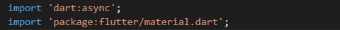

<table>
    <thead>
        <th style="text-align: center;" colspan="2">Pertemuan 12</th>
    </thead>
    <tbody>
        <tr>
            <td>Nama :</td>
            <td>Yayun Eldina</td>
        </tr>
        <tr>
            <td>Nim :</td>
            <td>2241720065</td>
        </tr>
    </tbody>
</table>

**********
# *Jobsheet 12 - Stream*
***********

## **Praktikum 2: Stream controllers dan sinks**

-----

#### **Langkah 1: Buka file stream.dart**
import package dart:async

#### **Langkah 2: Tambah class NumberStream**
Menambahkan class NumberStream

#### **Langkah 3: Tambah StreamController**
Menambahkan StreamController

#### **Langkah 4: Tambah method addNumberToSink**
Menambahkan method addNumberToSink

#### **Langkah 5: Tambah method close()**
Menambahkan method close()

#### **Langkah 6: Buka main.dart**
import package dart:async dan dart:math

#### **Langkah 7: Tambah variabel**
Menambahkan variabel lastNumber, StreamController, dan NumberStream

#### **Langkah 8: Edit initState()**

#### **Langkah 9: Edit dispose()**

#### **Langkah 10: Tambah method addRandomNumber()**
Menambahkan method addRandomNumber()

#### **Langkah 11: Edit method build()**

#### **Langkah 12: Run**
Menjalankan aplikasi

## **Soal 6**
1. Jelaskan maksud kode langkah 8 dan 10 tersebut!
2. Capture hasil praktikum Anda berupa GIF dan lampirkan di README.

-----

#### **Jawaban**
1. Maksud dari kode langkah 8 adalah untuk menginisialisasi variabel lastNumber, StreamController, dan NumberStream. Variabel lastNumber digunakan untuk menyimpan nilai terakhir dari stream yang dihasilkan. StreamController digunakan untuk mengontrol stream yang dihasilkan. NumberStream digunakan untuk mengatur stream yang dihasilkan.

Maksud dari kode langkah 10 adalah untuk menambahkan angka random dari 0-9 ke dalam stream yang dihasilkan. Angka random tersebut akan ditambahkan ke dalam sink yang ada pada stream yang dihasilkan.

#### **Langkah 13: Buka stream.dart**
Menambahkan method addError()

#### **Langkah 14: Buka main.dart**
Tambahkan method onError di dalam class StreamHomePageState pada method listen di fungsi initState().

#### **Langkah 14: Buka main.dart**
Menambahkan kode untuk menambahkan error ke dalam stream.

## **Soal 7**
1. Jelaskan maksud kode langkah 13 sampai 15 tersebut!
Kembalikan kode seperti semula pada Langkah 15, comment addError() agar Anda dapat melanjutkan ke praktikum 3 berikutnya.

-----

#### **Jawaban**
1. Maksud dari kode langkah 13 adalah untuk menambahkan error ke dalam stream yang dihasilkan. Error tersebut akan ditambahkan ke dalam sink yang ada pada stream yang dihasilkan.

