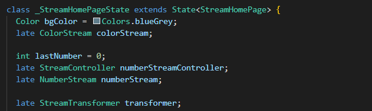
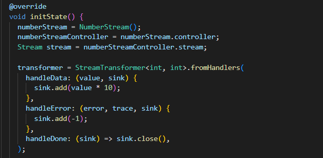
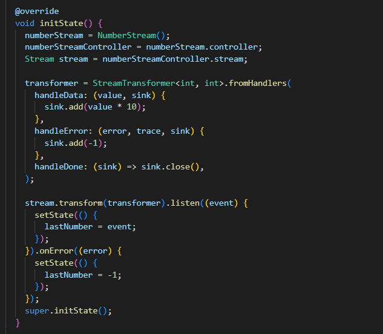

<table>
    <thead>
        <th style="text-align: center;" colspan="2">Pertemuan 12</th>
    </thead>
    <tbody>
        <tr>
            <td>Nama :</td>
            <td>Yayun Eldina</td>
        </tr>
        <tr>
            <td>Nim :</td>
            <td>2241720065</td>
        </tr>
    </tbody>
</table>

**********
# *Jobsheet 12 - Stream*
***********

## **Praktikum 3: Injeksi data ke streams**

-----

#### **Langkah 1: Buka main.dart**
Menambahkan variabel StreamTransformer

#### **Langkah 2: Tambahkan kode ini di initState**

#### **Langkah 3: Tetap di initState**
Mengubah bagian streamController

#### **Langkah 4: Run**
Menjalankan aplikasi

## **Soal 8**
1. Jelaskan maksud kode langkah 1-3 tersebut!
2. Capture hasil praktikum Anda berupa GIF dan lampirkan di README.

-----

#### **Jawaban**
1. - Langkah 1 adalah untuk menambahkan variabel StreamTransformer yang digunakan untuk mengubah data yang diterima dari stream.

- Langkah 2 adalah untuk menginisialisasi variabel StreamTransformer yang telah didefinisikan sebelumnya.

- Langkah 3 adalah untuk mengubah bagian streamController yang digunakan untuk mengontrol stream yang dihasilkan.

2. Hasilnya:

