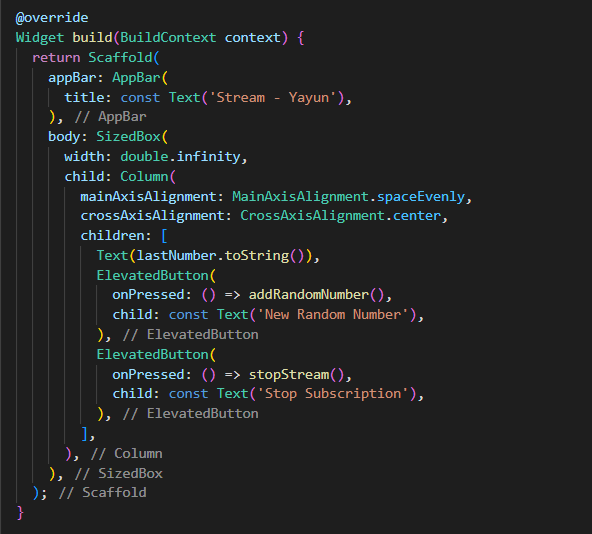

<table>
    <thead>
        <th style="text-align: center;" colspan="2">Pertemuan 12</th>
    </thead>
    <tbody>
        <tr>
            <td>Nama :</td>
            <td>Yayun Eldina</td>
        </tr>
        <tr>
            <td>Nim :</td>
            <td>2241720065</td>
        </tr>
    </tbody>
</table>

**********
# *Jobsheet 12 - Stream*
***********

## **Praktikum 4: Subscribe ke stream events**

-----

#### **Langkah 1: Tambah variabel**
Menambahkan variabel StreamSubscription

#### **Langkah 2: Edit initState()**

#### **Langkah 3: Tetap di initState()**
Menaambahkan kode handle Error

#### **Langkah 4: Tambah properti onDone()**
Menambahkan properti onDone()

#### **Langkah 5: Tambah method baru**
Menambahkan method stopStream()

#### **Langkah 6: Pindah ke method dispose()**
Menambahkan subscribe.cancel() ke dalam method dispose()

#### **Langkah 7: Pindah ke method build()**
Menambahkan button kedua yaitu stopStream()

#### **Langkah 8: Edit method addRandomNumber()**

#### **Langkah 9: Run**
Menjalankan aplikasi

#### **Langkah 10: Tekan button Stop Subscription**
Maka akan muncul tulisan 'OnDone was called'

## **Soal 9**
1. Jelaskan maksud kode langkah 2, 6 dan 8 tersebut!
2. Capture hasil praktikum Anda berupa GIF dan lampirkan di README.

-----

#### **Jawaban**
1. - Langkah 2 adalah untuk menginisialisasi variabel StreamSubscription yang digunakan untuk melakukan subscribe ke stream yang dihasilkan.

- Langkah 6 adalah untuk membatalkan subscribe ke stream yang dihasilkan ketika aplikasi dihentikan.

- Langkah 8 adalah untuk menambahkan angka random dari 0-9 ke dalam stream yang dihasilkan. Angka random tersebut akan ditambahkan ke dalam sink yang ada pada stream yang dihasilkan.

2. Hasilnya:

