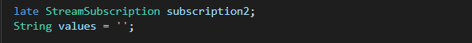
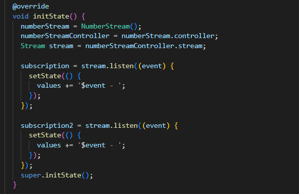
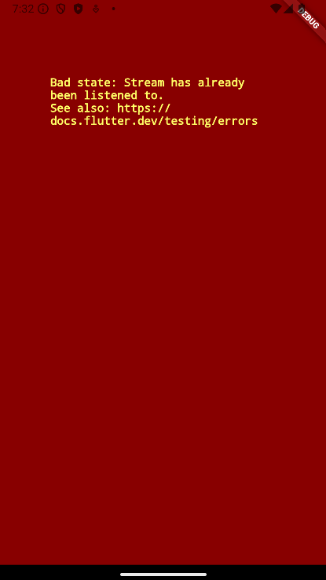
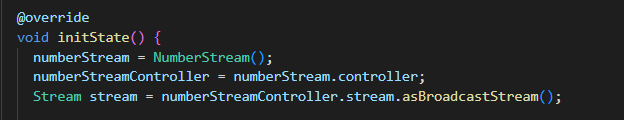
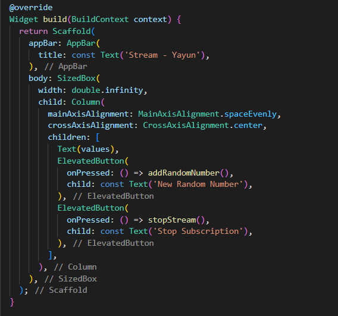
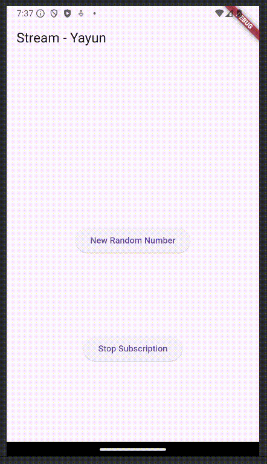

<table>
    <thead>
        <th style="text-align: center;" colspan="2">Pertemuan 12</th>
    </thead>
    <tbody>
        <tr>
            <td>Nama :</td>
            <td>Yayun Eldina</td>
        </tr>
        <tr>
            <td>Nim :</td>
            <td>2241720065</td>
        </tr>
    </tbody>
</table>

**********
# *Jobsheet 12 - Stream*
***********

## **Praktikum 5: Multiple stream subscriptions**

-----

#### **Langkah 1: Buka file main.dart**
Menambahkan variabel StreamSubscription dan String values

#### **Langkah 2: Edit initState()**

#### **Langkah 3: Run**
Akan terjadi error saat dijalankan

## **Soal 10**
1. Jelaskan mengapa error itu bisa terjadi ?
-----
#### **Jawaban**
1. Error terjadi karena stream yang dihasilkan hanya bisa di-subscribe satu kali. Ketika stream tersebut di-subscribe lebih dari satu kali, maka akan terjadi error.

#### **Langkah 4: Set broadcast stream**
Mengubah stream yang dihasilkan menjadi broadcast stream

#### **Langkah 5: Edit method build()**
Memasukkan variabel values ke dalam Text()

#### **Langkah 6: Run**
Menjalankan aplikasi

## **Soal 11**
1. Jelaskan mengapa hal itu bisa terjadi ?
2. Capture hasil praktikum Anda berupa GIF dan lampirkan di README.
-----
#### **Jawaban**
1. Hal itu bisa terjadi karena stream yang dihasilkan telah diubah menjadi broadcast stream. Broadcast stream memungkinkan stream yang dihasilkan dapat di-subscribe lebih dari satu kali dan teks akan ditambahkan setiap kali tombol Add Random Number ditekan.

2. Hasilnya

