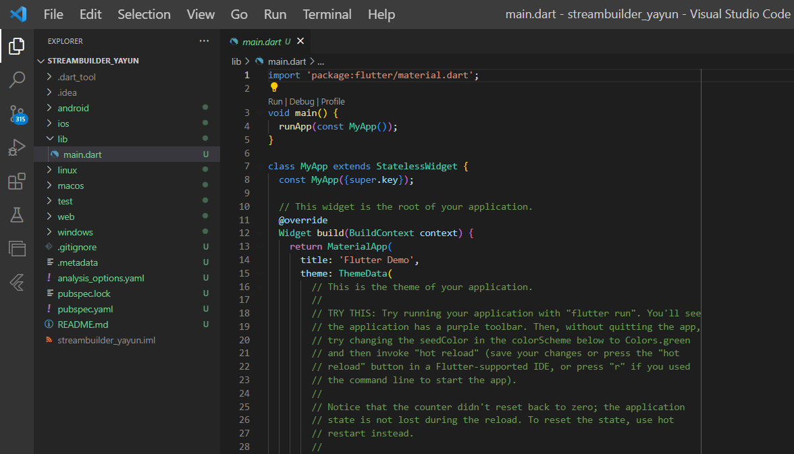
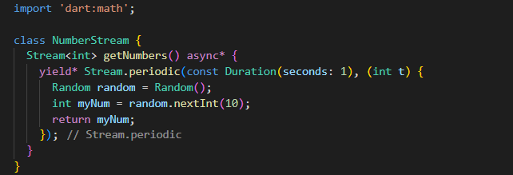

<table>
    <thead>
        <th style="text-align: center;" colspan="2">Pertemuan 12</th>
    </thead>
    <tbody>
        <tr>
            <td>Nama :</td>
            <td>Yayun Eldina</td>
        </tr>
        <tr>
            <td>Nim :</td>
            <td>2241720065</td>
        </tr>
    </tbody>
</table>

**********
# *Jobsheet 12 - Stream*
***********

## **Praktikum 6: StreamBuilder**

-----

#### **Langkah 1: Buat Project Baru**
Buatlah sebuah project flutter baru dengan nama streambuilder_nama (beri nama panggilan Anda) di folder week-12/src/ repository GitHub Anda. 

#### **Langkah 2: Buat file baru stream.dart**
Membuat class NumberStream

#### **Langkah 3: Tetap di file stream.dart**
Membuat method getNumbers() dengan async*.

#### **Langkah 4: Edit main.dart**

#### **Langkah 5: Tambah variabel**
Meambahkan variabel late Stream.

#### **Langkah 6: Edit initState()**

#### **Langkah 7: Edit method build()**
Menampilkan hasil stream yang dihasilkan.

#### **Langkah 8: Run**
Menjalankan aplikasi

## **Soal 12**
1. Jelaskan maksud kode pada langkah 3 dan 7 !
2. Capture hasil praktikum Anda berupa GIF dan lampirkan di README.

-----
#### **Jawaban**
1. - Langkah 3 adalah untuk membuat method getNumbers() yang digunakan untuk menghasilkan stream yang berisi list angka random dari 0-9.

- Langkah 7 adalah untuk menampilkan hasil stream yang dihasilkan ke dalam aplikasi menggunakan StreamBuilder.

2. Hasilnya

