<table>
    <thead>
        <th style="text-align: center;" colspan="2">Pertemuan 12</th>
    </thead>
    <tbody>
        <tr>
            <td>Nama :</td>
            <td>Yayun Eldina</td>
        </tr>
        <tr>
            <td>Nim :</td>
            <td>2241720065</td>
        </tr>
    </tbody>
</table>

**********
# *Jobsheet 12 - Stream*
***********

## **Praktikum 7: BLoC Pattern**

-----

#### **Langkah 1: Buat Project baru**
Buatlah sebuah project flutter baru dengan nama bloc_random_nama (beri nama panggilan Anda) di folder week-12/src/ repository GitHub Anda. Lalu buat file baru di folder lib dengan nama random_bloc.dart.

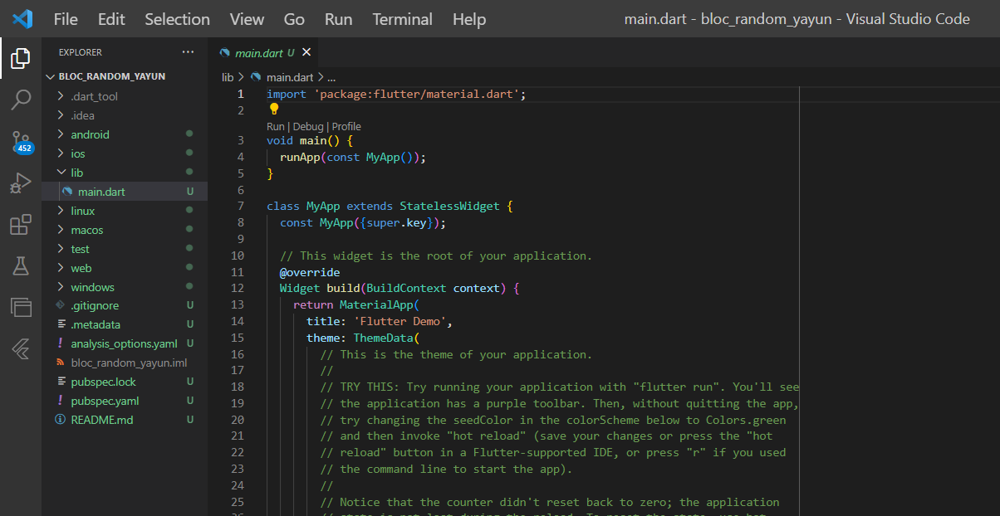

#### **Langkah 2: Isi kode random_bloc.dart**
Import package dart:async dan math

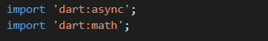

#### **Langkah 3: Buat class RandomNumberBloc()**
Memasukkan kode class RandomNumberBloc() di dalam file random_bloc.dart

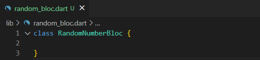

#### **Langkah 4: Buat variabel StreamController**
Menambahkan variabel StreamController di class RandomNumberBloc()

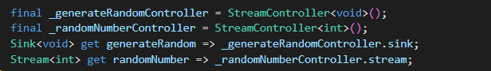

#### **Langkah 5: Buat constructor**
Menambahkan constructor di class RandomNumberBloc()

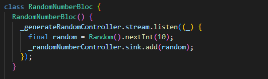

#### **Langkah 6: Buat method dispose()**
Menambahkan method dispose() di class RandomNumberBloc()

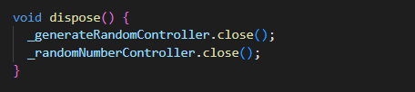

#### **Langkah 7: Edit main.dart**

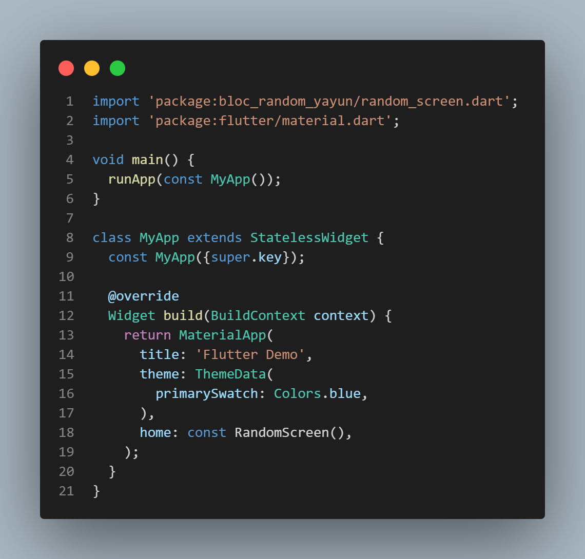

#### **Langkah 8: Buat file baru random_screen.dart**
Membuat file baru dengan nama random_screen.dart di dalam folder lib.

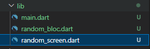

#### **Langkah 9: Lakukan impor material dan random_bloc.dart**
Import package material dan random_bloc.dart

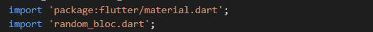

#### **Langkah 10: Buat StatefulWidget RandomScreen**
Membuat class RandomScreen yang merupakan StatefulWidget

#### **Langkah 11: Buat variabel**
Menambahkan variabel RandomNumberBloc di dalam class _RandomScreenState

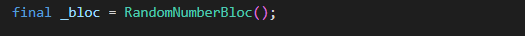

#### **Langkah 12: Buat method dispose()**
Menambahkan method dispose() di dalam class _RandomScreenState

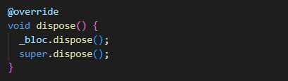

#### **Langkah 13: Edit method build()**

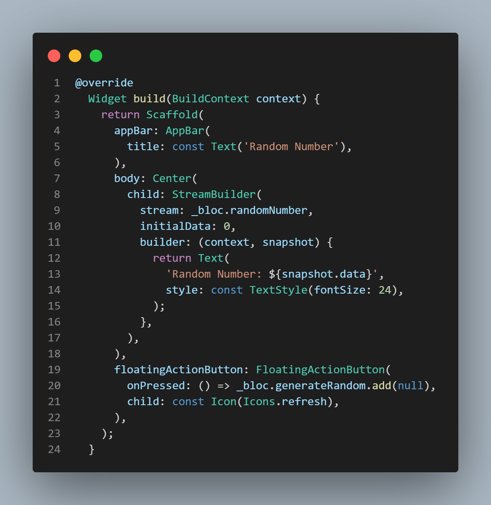

## **Soal 13**
1. Jelaskan maksud praktikum ini ! Dimanakah letak konsep pola BLoC-nya ?
2. Capture hasil praktikum Anda berupa GIF dan lampirkan di README.

-----

#### **Jawaban**
1. Maksud dari praktikum ini adalah untuk membuat aplikasi yang menggunakan pola BLoC. Pola BLoC adalah pola yang digunakan untuk memisahkan antara logika bisnis dan tampilan. Konsep pola BLoC terletak pada class RandomNumberBloc() yang digunakan untuk mengatur stream yang dihasilkan. Dan pada setiap perubahan pada stream akan diatur oleh class RandomNumberBloc() dan akan ditampilkan ke dalam aplikasi menggunakan StreamBuilder.

2. Hasilnya

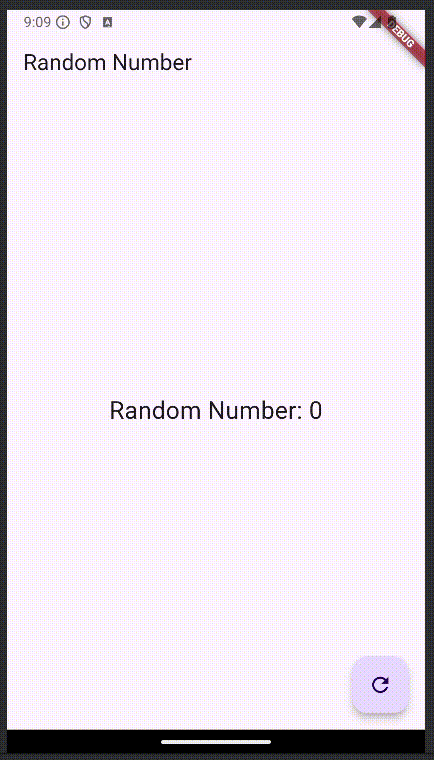

