# LAPORAN JOBSHEET 3 
NIM     : 2241720065

Nama    : Yayun Eldina

Kelas   : TI-3F / 27

# Praktikum 1: Menerapkan Control Flows ("if/else")
## Langkah 1
* Input

    ```
        void main() {
            String test = "test2";
            if (test == "test1") {
             print("Test1");
            } else if (test == "test2") {
            print("Test2");
            } else {
            print("Something else");
            }

            if (test == "test2") print("Test2 again");
        }
    ```

## Langkah 2
* Output
    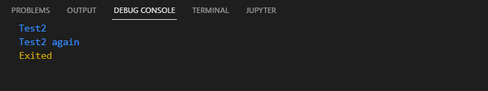

* Soal
Silakan coba eksekusi (Run) kode pada langkah 1 tersebut. Apa yang terjadi? Jelaskan!

* Penjelasan
Output yang ditampilkan adalah "test2" dan "test2 again" karena kondisi kedua terpenuhi pada kedua pernyataan if yang terpisah, sehingga kedua teks tersebut dicetak.

## Langkah 3
### Hasil Eror
* Input
    ```
        void main(){
            String test = "true";
            if (test) {
                print("Kebenaran");
            }
        }
    ```

* Output
    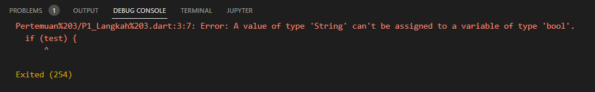

* Penjelasan
Pada data dalam dart diatas, pernyataan if membutuhkan kondisi berupa nilai boolean (true atau false). Namun, karena "test" adalah String, bukan boolean, ini akan menyebabkan error saat kompilasi.

### Hasil Benar
* Input
    ```
        void main(){
            String test = "true";
            if (test=="true") {
                print("Kebenaran");
            }
        }
    ```

* Output
    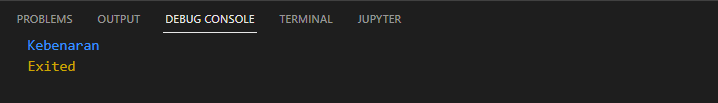

* Penjelasan
Pada kode Dart diats memeriksa apakah `test` bernilai "true" (String). Jika benar, pernyataan if mencetak "Kebenaran". Ini berfungsi karena kondisi membandingkan dua String, bukan langsung menggunakan `test` sebagai boolean.

# Praktikum 2: Menerapkan Perulangan "while" dan "do-while"
## Langkah 1
* Input
    ```
        void main() {
            while (counter < 33) {
                print(counter);
                counter++;
            }
        }
    ```
        
* Output
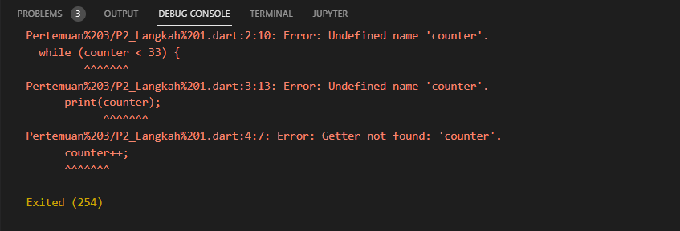

* Penjelasan
Kode error terjadi karena variabel `counter` belum dideklarasikan atau diinisialisasi. Untuk memperbaikinya, inisialisasi `counter` terlebih dahulu agar kode dapat menampilkan angka sampai 32.

## Langkah 2
* Input
    ```
        void main() {
            int counter = 0;
             while (counter < 33) {
                print(counter);
                counter++;
            }
        }
    ```

* Output
    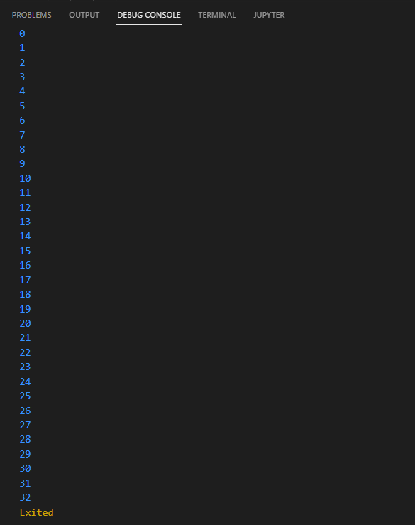

* Penjelasan
Setelah diperbaiki dengan menginisialisasi counter, kode akan menampilkan angka dari 0 hingga 32, sesuai dengan batasan while (counter < 33).

## Langkah 3
### Hasil Eror
* Input
    ```
       void main() {
            do {
                print(counter);
                counter++;
            } while (counter < 77);
        }
    ```

* Output
    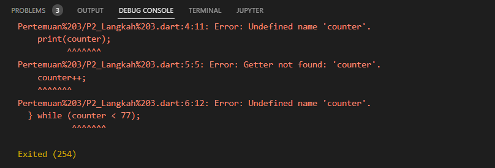

* Penjelasan
Error terjadi karena variabel counter yang digunakan dalam loop do-while belum dideklarasikan atau diinisialisasi. 

### Hasil Benar
* Input
    ```
        void main() {
            int counter = 0;
            do {
                print(counter);
                counter++;
            } while (counter < 77);
        }
    ```

* Output
    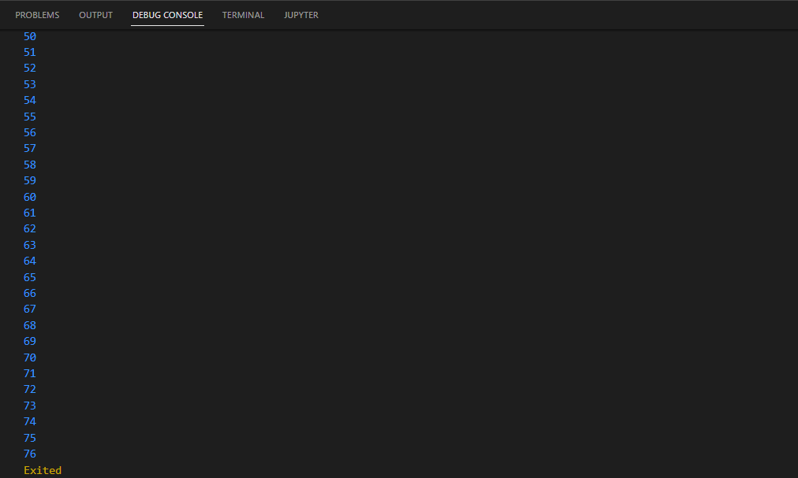

* Penjelasan
Setelah diperbaiki dengan mendeklarasikan dan menginisialisasi counter sebagai int counter = 0;, kode akan berjalan tanpa error dan mencetak angka dari 0 hingga 76, sesuai dengan kondisi while (counter < 77).

# Praktikum 3: Menerapkan Perulangan "for" dan "break-continue"
## Langkah 1
### Hasil Eror
* Input
    ```
        void main() {
            for (Index = 10 ; index < 27; index) {
                print(index);
            }
        }
    ```

* Output
    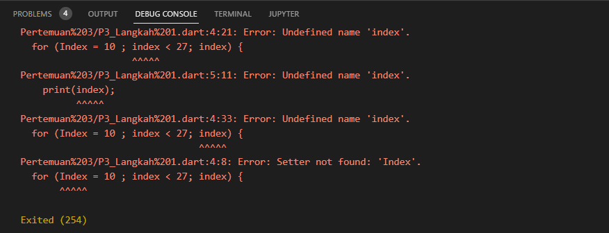

* Penjelasan
Error terjadi karena variabel index belum dideklarasikan dan tidak ada operator increment.

## Langkah 2
### Hasil Perbaikan
* Input

        ``` 
            void main() {
                for (int index = 10 ; index < 27; index++) {
                    print(index);
                }
            }
        ```
* Output
     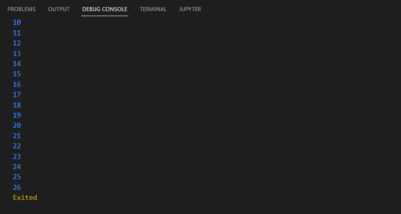

* Penjelasan
Setelah diperbaiki dengan mendeklarasikan index di dalam perulangan for dan menambahkan increment otomatis, kode akan berjalan dengan benar dan mencetak angka dari 10 hingga 26, sesuai dengan kondisi index < 27.

## Langkah 3
### Hasil Eror
* Input

    ```
        void main() {
            If (Index == 21) break;
            Else If (index > 1 || index < 7) continue;
            print(index);
        }
    ```

* Output
    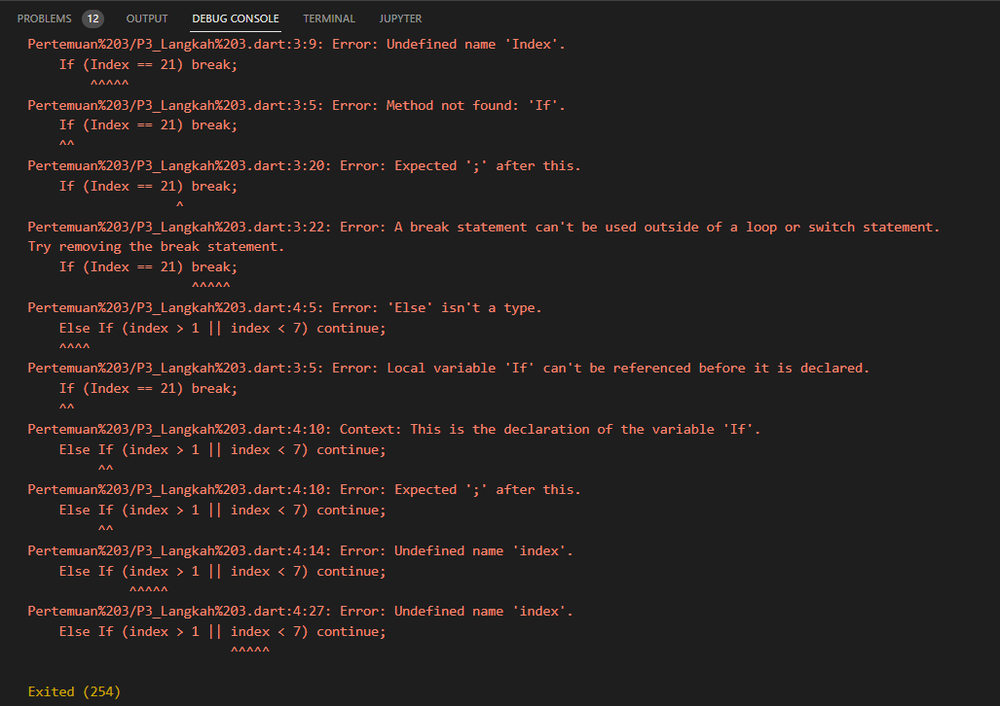

* Penjelasan
Kode error terjadi karena penggunaan if-else dengan huruf kapital dan penempatan break serta continue yang salah.

### Hasil Benar
* Input

    ```
        void main() {
            for (int index = 0; index < 30; index++) {
                if (index == 21)
                    break;
                else if (index > 1 && index < 7) 
                    continue;
                print(index);
            }
        }
    ```

* Output
        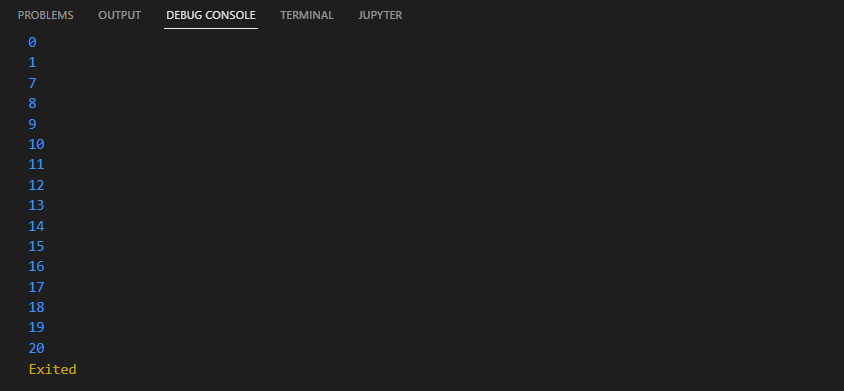

* Penjelasan
Setelah diperbaiki kode diatas akan menampilkan angka dari 0 hingga 20, kecuali angka 2 hingga 6. Ini karena continue melewati angka 2 hingga 6, dan break menghentikan loop ketika index mencapai 21.

## Tugas
* Soal
Buatlah sebuah program yang dapat menampilkan bilangan prima dari angka 0 sampai 201 menggunakan Dart. Ketika bilangan prima ditemukan, maka tampilkan nama lengkap dan NIM Anda.

* Input

    ```
        bool isPrime(int num) {
            if (num <= 1) return false;
            if (num == 2) return true;
            if (num % 2 == 0) return false;
            for (int i = 3; i * i <= num; i += 2) {
                if (num % i == 0) return false;
            }
            return true;
        }  
             

        void main() {
            String fullName = "Yayun Eldina";
            String nim = "2241720065";

            print('Bilangan Prima dari 0 hingga 201:');
            for (int number = 0; number <= 201; number++) {
                if (isPrime(number)) {
                    print('$number =  $fullName (NIM: $nim)');
                }
            }
        }
    ```

* Output

