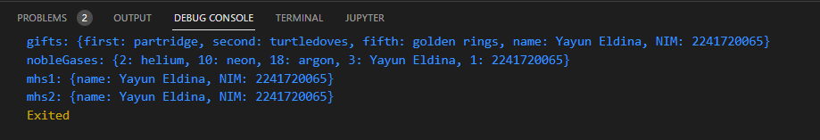

# LAPORAN JOBSHEET 4 
NIM     : 2241720065

Nama    : Yayun Eldina

Kelas   : TI-3F / 27

# Praktikum 1: Eksperimen Tipe Data List
## Langkah 1
Ketik atau salin kode program berikut ke dalam void main().

* Input

    ```
        void main() {
            var list = [1, 2, 3];
            assert(list.length == 3);
            assert(list[1] == 2);
            print(list.length);
            print(list[1]);

            list[1] = 1;
            assert(list[1] == 1);
            print(list[1]);
        }
    ```

## Langkah 2
Silakan coba eksekusi (Run) kode pada langkah 1 tersebut. Apa yang terjadi? Jelaskan!

* Output

    

* Penjelasan
Kode program berhasil dijalankan karena semua kondisi `assert` terpenuhi. Panjang list adalah 3, elemen kedua awalnya 2, lalu diubah menjadi 1. Dengan hasil, panjang list (3), elemen kedua sebelum (2), dan setelah perubahan (1).

## Langkah 3
Ubah kode pada langkah 1 menjadi variabel final yang mempunyai index = 5 dengan default value = null. Isilah nama dan NIM Anda pada elemen index ke-1 dan ke-2. Lalu print dan capture hasilnya. Apa yang terjadi ? Jika terjadi error, silakan perbaiki.

* Input

    ```
        void main() {
            final List<dynamic> list = List.filled(5, null);  
            list[1] = "Yayun Eldina";  
            list[2] = "2241720065";  

            assert(list.length == 5);  
            assert(list[1] == "Yayun Eldina"); 
            assert(list[2] == "2241720065");  

            print(list.length);  
            print(list[1]);  
            print(list[2]);  
        }
    ```

* Output

    

* Penjelasan
Kode ini berhasil dijalankan karena semua kondisi dalam assert terpenuhi. Output dari program ini akan menunjukkan panjang list dan kedua elemen yang telah ditambahkan. Program tidak akan mengeluarkan error karena semua kondisi assert telah terpenuhi.


# Praktikum 2: Eksperimen Tipe Data Set
## Langkah 1
Ketik atau salin kode program berikut ke dalam fungsi main().

* Input

    ```
        void main() {
            var halogens = {'fluorine', 'chlorine', 'bromine', 'iodine', 'astatine'};
            print(halogens);
        }
    ```

## Langkah 2
Silakan coba eksekusi (Run) kode pada langkah 1 tersebut. Apa yang terjadi? Jelaskan! Lalu perbaiki jika terjadi error.

* Output

    

* Penjelasan
Kode program berhasil dijalankan karena semua kondisi terpenuhi: set `halogens` dideklarasikan dengan benar dan mencetak isi set ke konsol.

## Langkah 3
Tambahkan kode program berikut, lalu coba eksekusi (Run) kode Anda.
Apa yang terjadi ? Jika terjadi error, silakan perbaiki namun tetap menggunakan ketiga variabel tersebut. Tambahkan elemen nama dan NIM Anda pada kedua variabel Set tersebut dengan dua fungsi berbeda yaitu .add() dan .addAll(). Untuk variabel Map dihapus, nanti kita coba di praktikum selanjutnya.

* Input

    ```
        void main() {
            var names1 = <String>{}; 
            Set<String> names2 = {}; 
            Set<String> names3 = {}; 

            names1.add('Yayun Eldina'); 
            names2.add('2241720065'); 
            names3.addAll(['Yayun Eldina', '2241720065']); 

            print(names1);
            print(names2); 
            print(names3);
        }
    ```
* Output

    

* Penjelasan
Kode tersebut berhasil dijalankan karena semua program `.add()` dan `.addAll()` berhasil diterapkan untuk menambahkan elemen ke set.

# Praktikum 3: Eksperimen Tipe Data Maps
## Langkah 1
Ketik atau salin kode program berikut ke dalam fungsi main().

* Input

    ```
        void main () {
            var gifts = {
                // Key:    Value
                'first': 'partridge',
                'second': 'turtledoves',
                'fifth': 1
            };

            var nobleGases = {
                2: 'helium',
                10: 'neon',
                18: 2,
            };

            print(gifts);
            print(nobleGases);
        }
    ```

## Langkah 2
Silakan coba eksekusi (Run) kode pada langkah 1 tersebut. Apa yang terjadi? Jelaskan! Lalu perbaiki jika terjadi error.

* Output

    

* Penjelasan
Kode program berhasil dijalankan karena semua kondisi map, `gifts` dan `nobleGases`, memiliki pasangan key-value yang valid, dengan kombinasi tipe data string dan integer yang sesuai.

## Langkah 3
Tambahkan kode program berikut, lalu coba eksekusi (Run) kode Anda.
Apa yang terjadi ? Jika terjadi error, silakan perbaiki. Tambahkan elemen nama dan NIM Anda pada tiap variabel di atas (gifts, nobleGases, mhs1, dan mhs2). Dokumentasikan hasilnya dan buat laporannya!

* Input

    ```
        void main() {
            // Mendeklarasikan dan mengisi Map gifts
            var gifts = Map<String, String>();
            gifts['first'] = 'partridge';
            gifts['second'] = 'turtledoves';
            gifts['fifth'] = 'golden rings';
            gifts['name'] = 'Yayun Eldina'; // Nama
            gifts['NIM'] = '2241720065'; // NIM

            // Mendeklarasikan dan mengisi Map nobleGases
            var nobleGases = Map<int, String>();
            nobleGases[2] = 'helium';
            nobleGases[10] = 'neon';
            nobleGases[18] = 'argon';
            nobleGases[3] = 'Yayun Eldina'; // Nama
            nobleGases[1] = '2241720065'; // NIM

            // Mendeklarasikan Map mhs1 dan mhs2
            var mhs1 = Map<String, String>();
            mhs1['name'] = 'Yayun Eldina'; // Nama
            mhs1['NIM'] = '2241720065'; // NIM

            var mhs2 = Map<String, String>();
            mhs2['name'] = 'Yayun Eldina'; // Nama
            mhs2['NIM'] = '2241720065'; // NIM

            // Mencetak hasil
            print('gifts: $gifts');
            print('nobleGases: $nobleGases');
            print('mhs1: $mhs1');
            print('mhs2: $mhs2');
        }

    ```
* Output

    

* Penjelasan
Kode program berhasil dijalankan karena semua kondisi terpenuhi. Dua map, `gifts` dan `nobleGases`, dideklarasikan dan diisi dengan pasangan key-value yang valid. Setelah itu, data dalam map `mhs1` dan `mhs2` ditambahkan dengan tipe key dan value yang sesuai. Fungsi `print()` digunakan untuk menampilkan isi dari semua map tanpa error.

# Praktikum 4: Eksperimen Tipe Data List: Spread dan Control-flow Operators
## Langkah 1
Ketik atau salin kode program berikut ke dalam fungsi main().

* Input 

    ```
        void main() {
            var list = [1, 2, 3];
            var list2 = [0, ...list];
            print(list1);
            print(list2);
            print(list2.length);
         }
    ```

## Langkah 2
Silakan coba eksekusi (Run) kode pada langkah 1 tersebut. Apa yang terjadi? Jelaskan! Lalu perbaiki jika terjadi error.

* Output Eror

    

* Penjelasan
- Error terjadi karena kesalahan pengetikan (`list1`), yang seharusnya `list`. Dart menganggap variabel yang tidak dideklarasikan sebagai *undefined*, sehingga program tidak bisa dijalankan sampai kesalahan ini diperbaiki.

### Perbaikan
* Input

    ```
        void main() {
            var list = [1, 2, 3];     
            var list2 = [0, ...list]; 
            print(list);             
            print(list2);             
            print(list2.length);      
        }
    ```

* Output

    

* Penjelasan
Setelah perbaikan, variabel list1 diganti dengan list, yang memang sudah dideklarasikan sebelumnya. Hal ini membuat program berjalan dengan benar.

## Langkah 3
Tambahkan kode program berikut, lalu coba eksekusi (Run) kode Anda.
Apa yang terjadi ? Jika terjadi error, silakan perbaiki. Tambahkan variabel list berisi NIM Anda menggunakan Spread Operators. Dokumentasikan hasilnya dan buat laporannya!

### Hasil Eror
* Input

    ```
        void main() {
            list1 = [1, 2, null];
            print(list1);
            var list3 = [0, ...?list1];
            print(list3.length);
        }
    ```
* Output

    

* Penjelasan
Telah terjadi error pada kode ini karena `list1` belum dideklarasikan dengan benar dalam kode Dart.

### Hasil Perbaikan
* Input

    ```
        void main() {
            var list1 = [1, 2, null];
            print(list1);

            var nim = ['2241720065']; 
            var list2 = [3, 4, 5]; 

            var list3 = [0, ...?list1];
            print(list3.length); 

            var listBaru = [...list3, ...list2, ...nim]; 
            print(listBaru); 
        }
    ```
* Output

     

## Langkah 4
Tambahkan kode program berikut, lalu coba eksekusi (Run) kode Anda.
Apa yang terjadi ? Jika terjadi error, silakan perbaiki. Tunjukkan hasilnya jika variabel promoActive ketika true dan false.

### Hasil eror
* Input

    ```
        void main() {
            var nav = ['Home', 'Furniture', 'Plants', if (promoActive) 'Outlet'];
            print(nav);
        }
    ```
* Output

    
     

* Penjelasan 
Error yang terjadi karena pada kode dart variabel promoActive tidak didefinisikan sebelum digunakan dalam list nav.

### Hasil Perbaikan
#### True
* Input

    ```
        void main() {
            bool promoActive = true; // Atau false, sesuai kebutuhan
            var nav = ['Home', 'Furniture', 'Plants', if (promoActive) 'Outlet'];
            print(nav);
        }

    ```
* Output

     

#### False
* Input

  
    ```
        void main() {
            bool promoActive = false; // Atau false, sesuai kebutuhan
            var nav = ['Home', 'Furniture', 'Plants', if (promoActive) 'Outlet'];
            print(nav);
        }

    ```
* Output

    


* Penjelasan
Setelah perbaikan dengan mendefinisikan promoActive dengan nilai boolean (true atau false) sebelum membuat list nav kode program dalam dart dapat dijalankan sesuai dengan hasilnya.

## Langkah 5
Tambahkan kode program berikut, lalu coba eksekusi (Run) kode Anda.
Apa yang terjadi ? Jika terjadi error, silakan perbaiki. Tunjukkan hasilnya jika variabel login mempunyai kondisi lain.

### Hasil Eror
* Input

    ```
        void main() {
            var nav2 = ['Home', 'Furniture', 'Plants', if (login case 'Manager') 'Inventory'];
            print(nav2);
        }
    ```

* Output

     

* Penjelasan
Error terjadi karena variabel login tidak dideklarasikan sebelum digunakan, dan syntax case tidak tepat dalam konteks ini

### Hasil Perbaikan
* Input

    ```
        void main() {
            String login = 'Manager'; 
            var nav2 = [
                'Home',
                'Furniture',
                'Plants',
                if (login == 'Manager') 'Inventory'
            ];
            print(nav2);
        }
    ```

* Output

     
    
* Penjelasan
 Perbaikan telah likakukan dengan variabel login telah didefinisikan sebelum digunakan. Dengan menggunakan pernyataan if, kode memeriksa apakah login sama dengan 'Manager' dan menambahkan 'Inventory' ke dalam list nav2 jika kondisi tersebut terpenuhi. 

 ## Langkah 6
 Tambahkan kode program berikut, lalu coba eksekusi (Run) kode Anda.
 Apa yang terjadi ? Jika terjadi error, silakan perbaiki. Jelaskan manfaat Collection For dan dokumentasikan hasilnya.

  ### Hasil Perbaikan
 * Input

    ```
        void main() {
            var listOfInts = [1, 2, 3];
            var listOfStrings = ['#0', for (var i in listOfInts) '#$i'];
            assert(listOfStrings[1] == '#1');
            print(listOfStrings);
        }
    ```

 * Output

    

 * Penjelasan
 Manfaat Collection For dalam kode di atas adalah untuk membuat dan menginisialisasi koleksi baru dengan mudah dari elemen yang ada. Dengan menggunakan Collection For, kode menjadi lebih ringkas dan mudah dibaca, karena Anda tidak perlu menulis loop eksplisit. Dalam contoh ini, `listOfStrings` dibangun dengan menambahkan karakter '#' sebelum setiap angka dari `listOfInts`, menghasilkan koleksi baru yang lebih terformat tanpa kompleksitas tambahan.

# Praktikum 5: Eksperimen Tipe Data Records
## Langkah 1
Ketik atau salin kode program berikut ke dalam fungsi main().

### Hasil Eror
* Input

    ```
        void main() {
            var record = ('first', a: 2, b: true, 'last');
            print(record)
        }
    ```
## Langkah 2
Silakan coba eksekusi (Run) kode pada langkah 1 tersebut. Apa yang terjadi? Jelaskan! Lalu perbaiki jika terjadi error.

* Output

     

* Penjelasan
Error terjadi karena ada kesalahan sintaksis pada kode Anda. Pesan kesalahan menunjukkan bahwa Dart mengharapkan tanda titik koma (;) setelah pernyataan print(record).

### Hasil Perbaikan
* Input

    ```
        void main() {
            var record = ('first', a: 2, b: true, 'last');
            print(record);
        }
    ```

* Output

     

* Penjelasan
Setelah diperbaiki dengan menambahkan titik koma (;) setelah pernyataan print (record) kode program berhasil dijalankan.

## Langkah 3
Tambahkan kode program berikut di luar scope void main(), lalu coba eksekusi (Run) kode Anda.
Apa yang terjadi ? Jika terjadi error, silakan perbaiki. Gunakan fungsi tukar() di dalam main() sehingga tampak jelas proses pertukaran value field di dalam Records.

* Input

    ```
        (int, int) tukar((int, int) record) {
            var (a, b) = record;
            return (b, a);
        }

        void main() {
            // Mendefinisikan record awal
            var recordAwal = (3, 7);
            
            // Menampilkan record sebelum pertukaran
            print('Record sebelum ditukar: $recordAwal');
            
            // Memanggil fungsi tukar dan menyimpan hasilnya
            var recordTukar = tukar(recordAwal);
            
            // Menampilkan record setelah pertukaran
            print('Record setelah ditukar: $recordTukar');
        }
    ```

* Output 

     

* Penjelasan
Dari hasil program diatas fungsi tukar() menukar nilai dalam tuple (int, int) dan mengembalikannya. Di dalam main(), kita mendefinisikan recordAwal, menampilkan nilainya, memanggil tukar(), dan menampilkan hasil pertukarannya.

## Langkah 4
Tambahkan kode program berikut di dalam scope void main(), lalu coba eksekusi (Run) kode Anda.
Apa yang terjadi ? Jika terjadi error, silakan perbaiki. Inisialisasi field nama dan NIM Anda pada variabel record mahasiswa di atas. Dokumentasikan hasilnya dan buat laporannya!

* Input

    ```
        void main() {
            (String, int) mahasiswa = ('Yayun Eldina', 2241720065);
            print(mahasiswa);
        }
    ```

* Output

    

* Penjelasan
Hasil program tersebut mendefinisikan mahasiswa sebagai tuple (String, int) yang diinisialisasi dengan nama dan NIM, lalu mencetak nilainya.


## Langkah 5
Tambahkan kode program berikut di dalam scope void main(), lalu coba eksekusi (Run) kode Anda.
Apa yang terjadi ? Jika terjadi error, silakan perbaiki. Gantilah salah satu isi record dengan nama dan NIM Anda, lalu dokumentasikan hasilnya dan buat laporannya!

* Input

    ```
        void main() {
            // Mendefinisikan mahasiswa2 dengan tuple dan named parameters
            var mahasiswa2 = ('Yayun Eldina', a: 2241720065, b: true, 'last');

            // Mencetak nilai dari mahasiswa2
            print(mahasiswa2.$1); 
            print(mahasiswa2.a);   
            print(mahasiswa2.b);   
            print(mahasiswa2.$2);  
        }

    ```
    
* Output

     

* Penjelasan
Kode program berhasil dijalankan karena telah mendefinisikan `mahasiswa2` sebagai tuple dengan nilai `'Yayun Eldina'`, NIM sebagai named parameter `a`, `true` sebagai `b`, dan `'last'`, lalu mencetak nilainya.

