# **JOBSHEET 5**

## Nama     : Yayun Eldina
## NIM      : 2241720065
## Kelas    : Teknik Informatika - 3F
### Link GitHub : <https://github.com/YayunEldina/flutter_application_1>

# **Tugas Flutter First App**
## **Langkah 1: Setup pubspec.yaml**

 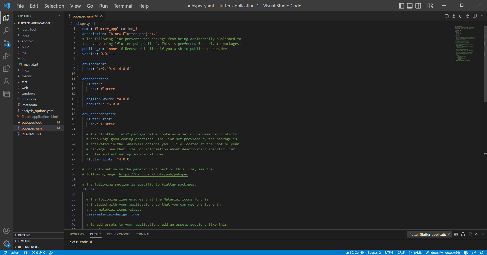

## **Langkah 2: Setup analysis_options.yaml**

 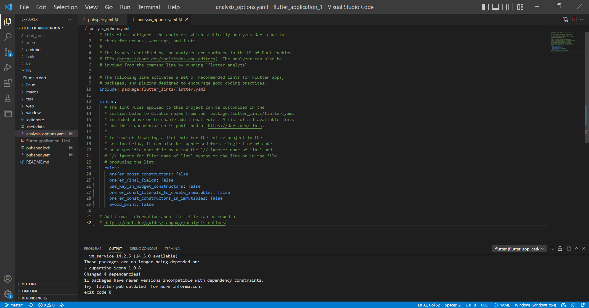

## **Langkah 3: Mengedit file lib/main.dart**

 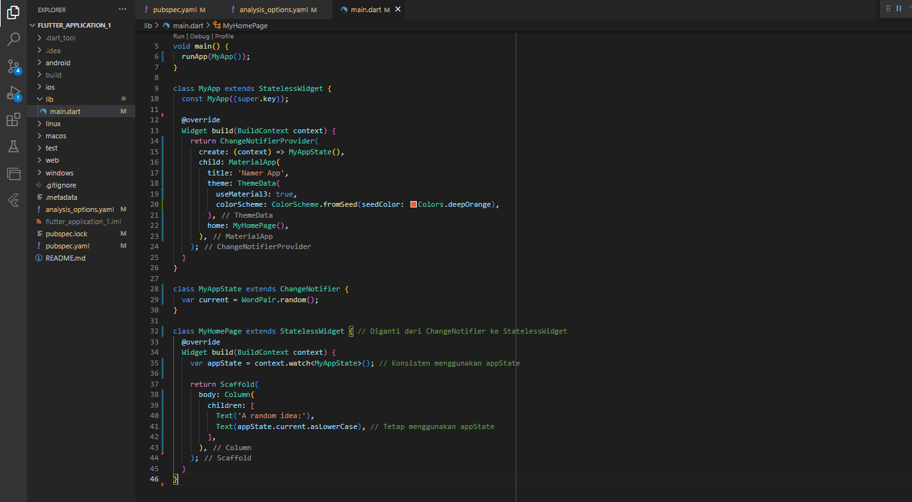

## **Langkah 4: Run project flutter**

 

 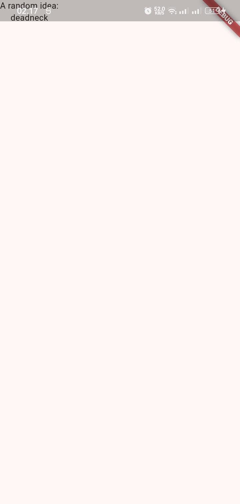

## **Langkah 5: Menambahkan Button**

 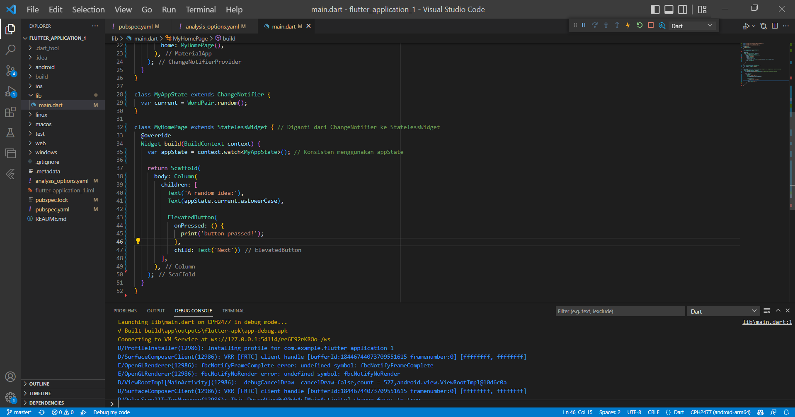

  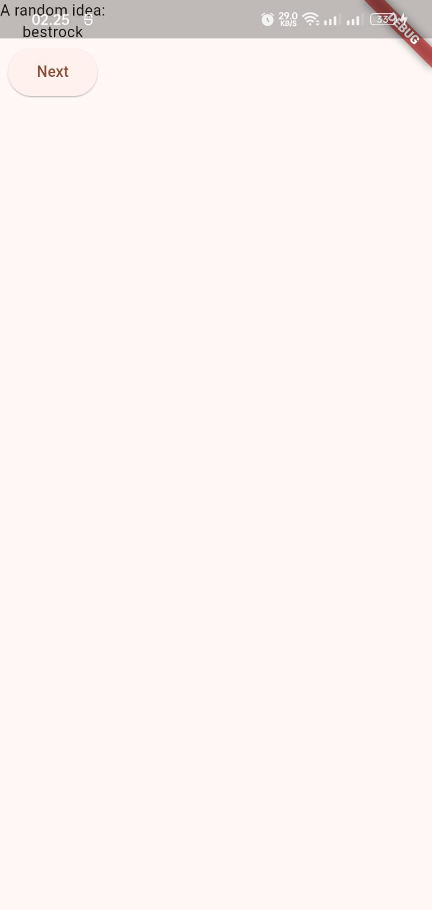

## **Langkah 6: Styling flutter app**

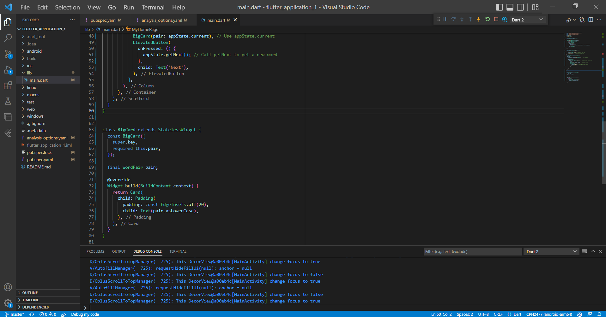

 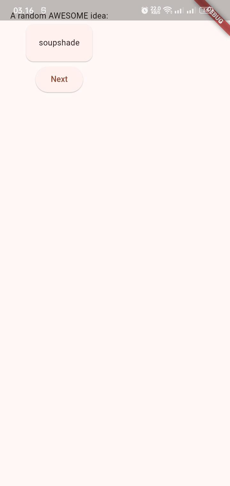

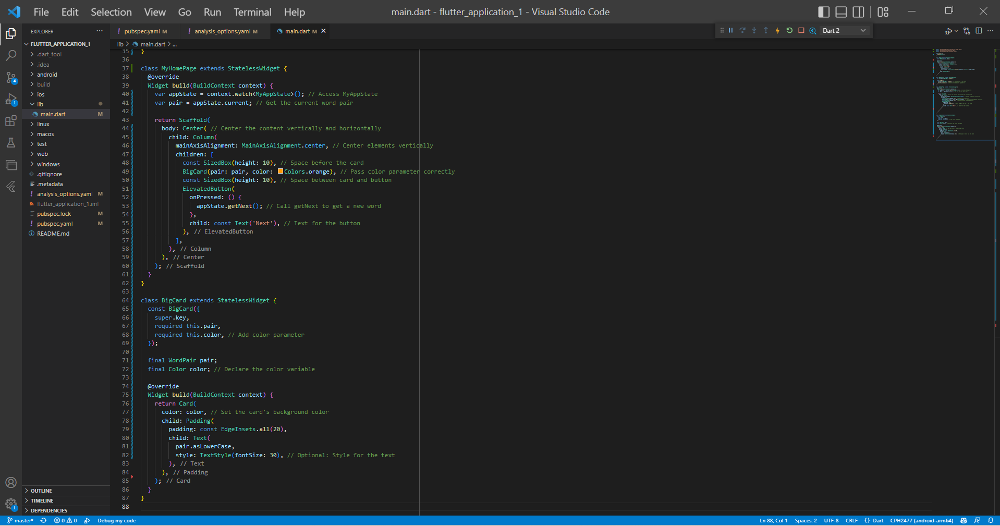

 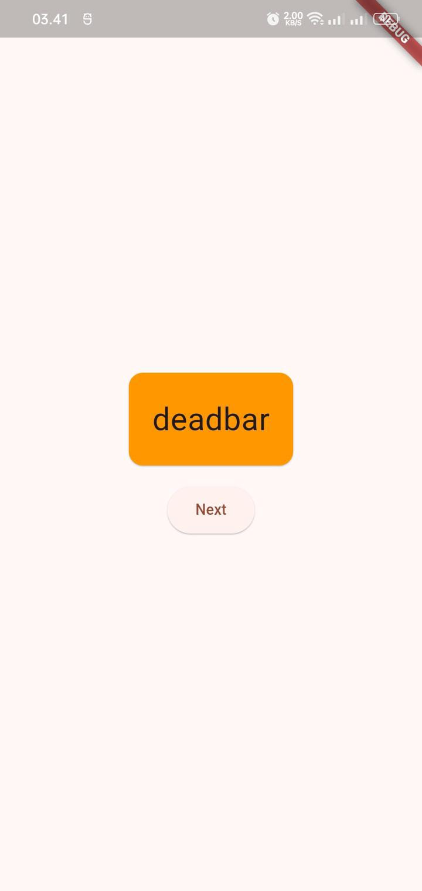

## **Langkah 7: Menambahkan Like Button**

 

  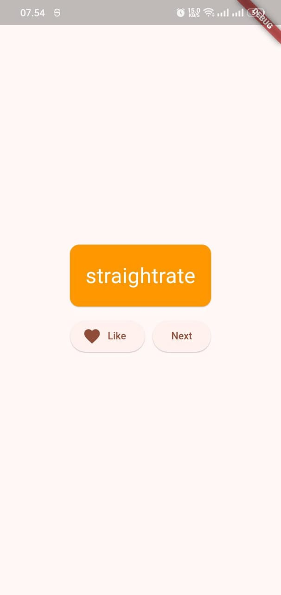

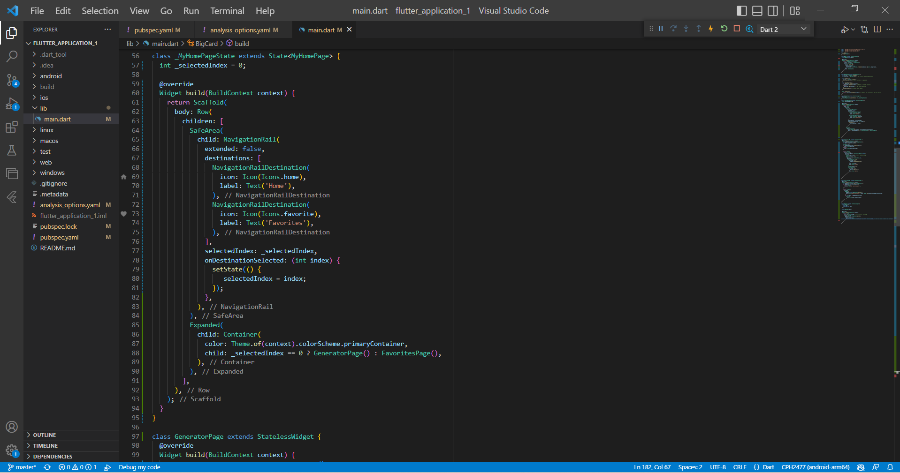

  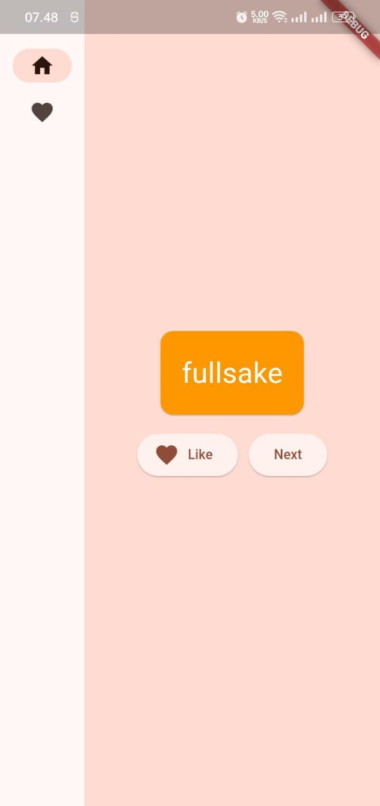

## **Langkah 8: Menambahkan navigasi dan halaman baru**

 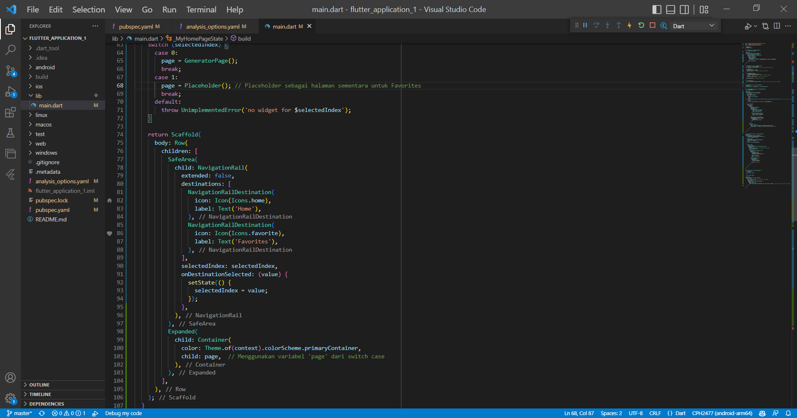

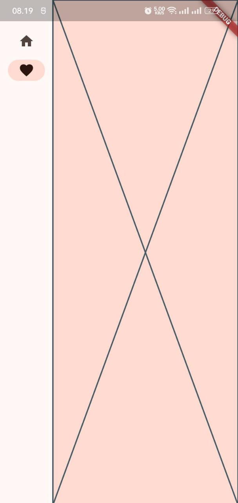

## **Langkah 9: Tingkat Responsif**

Berikutnya, kolom samping navigasi yang tidak responsif ketika ditampilkan pada layar Handphone karena tidak cukup ruang
 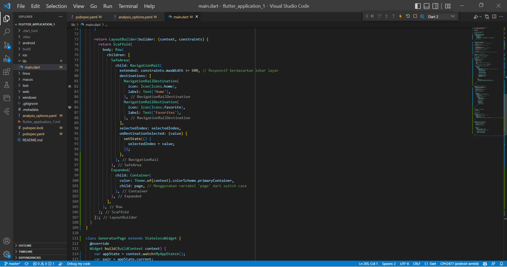

 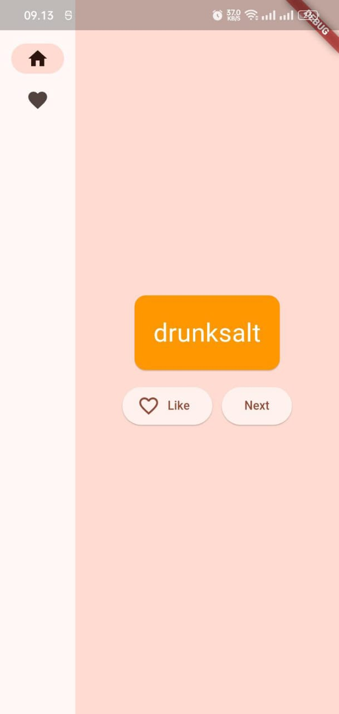

 Jika memang ingin ditampilkan pada layar Handphone bisa mengkreasikan dengan tema seperti ini

  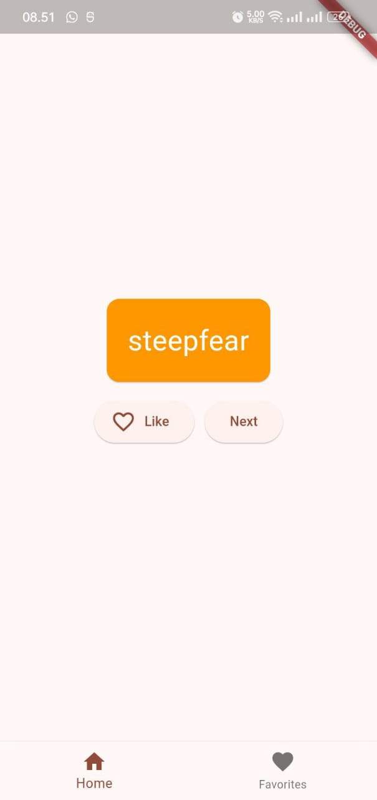

  ## **Langkah 10: Menambahkan View halaman favorit**

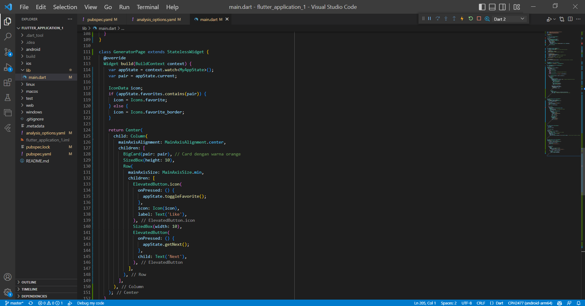

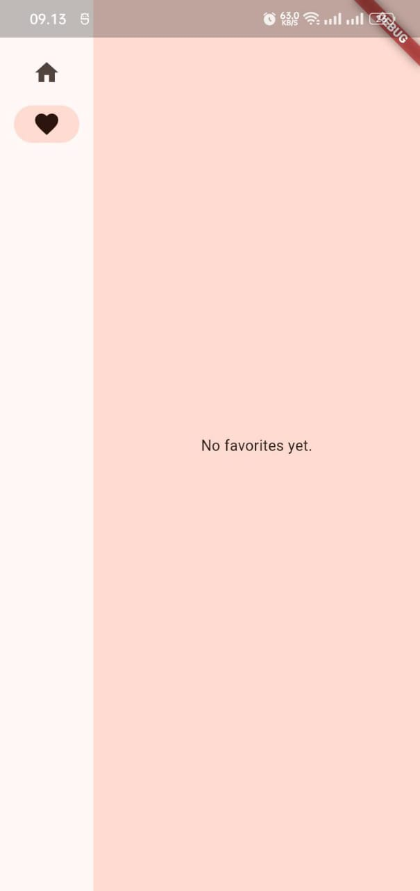

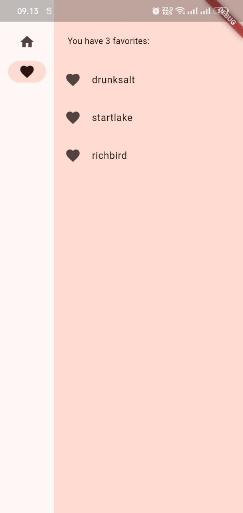