# **JOBSHEET 6**

## Nama     : Yayun Eldina
## NIM      : 2241720065
## Kelas    : Teknik Informatika - 3F

# **Praktikum 1: Membangun Layout di Flutter**
## **Langkah 1**
Buatlah sebuah project flutter baru dengan nama layout_flutter. Atau sesuaikan style laporan praktikum yang Anda buat.

## **Langkah 2**
Buka file main.dart lalu ganti dengan kode berikut. Isi nama dan NIM Anda di text title.
 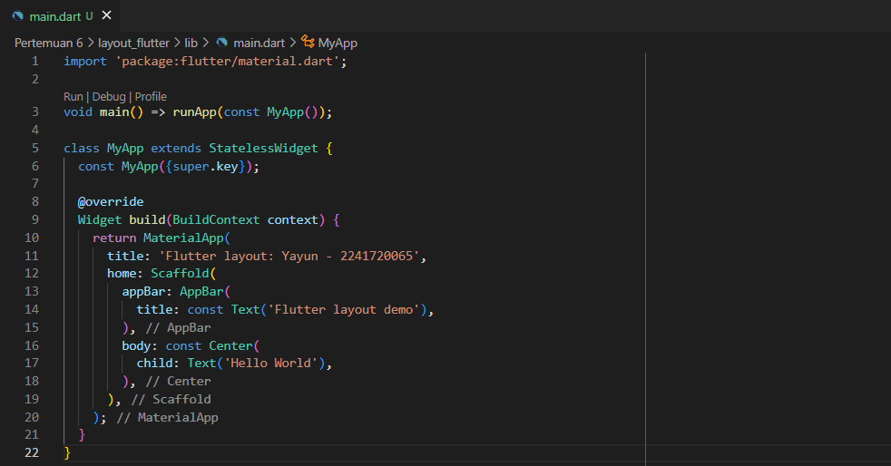

  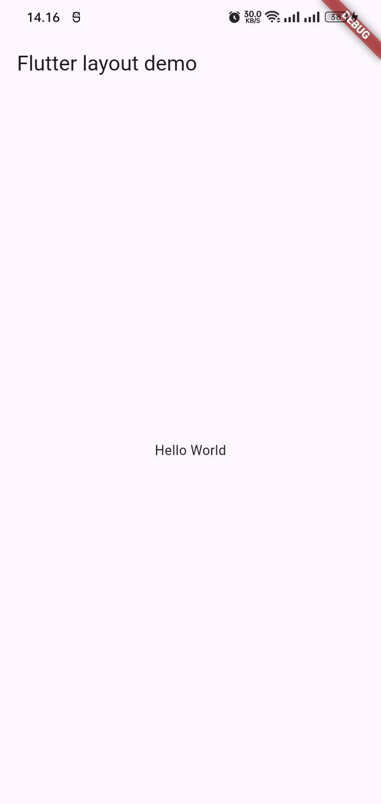

## **Langkah 3**
Buka file main.dart lalu ganti dengan kode berikut. Isi nama dan NIM Anda di text title.
Langkah pertama adalah memecah tata letak menjadi elemen dasarnya:
* Identifikasi baris dan kolom.
* Apakah tata letaknya menyertakan kisi-kisi (grid)?
* Apakah ada elemen yang tumpang tindih?
* Apakah UI memerlukan tab?
* Perhatikan area yang memerlukan alignment, padding, atau borders.

Pertama, identifikasi elemen yang lebih besar. Dalam contoh ini, empat elemen disusun menjadi sebuah kolom: sebuah gambar, dua baris, dan satu blok teks.

Selanjutnya, buat diagram setiap baris. Baris pertama, disebut bagian Judul, memiliki 3 anak: kolom teks, ikon bintang, dan angka. Anak pertamanya, kolom, berisi 2 baris teks. Kolom pertama itu memakan banyak ruang, sehingga harus dibungkus dengan widget yang Diperluas.

Baris kedua, disebut bagian Tombol, juga memiliki 3 anak: setiap anak merupakan kolom yang berisi ikon dan teks.

Setelah tata letak telah dibuat diagramnya, cara termudah adalah dengan menerapkan pendekatan bottom-up. Untuk meminimalkan kebingungan visual dari kode tata letak yang banyak bertumpuk, tempatkan beberapa implementasi dalam variabel dan fungsi.

## **Langkah 4**
Pertama, Anda akan membuat kolom bagian kiri pada judul. Tambahkan kode berikut di bagian atas metode build() di dalam kelas MyApp:

### **Soal 1**
Letakkan widget Column di dalam widget Expanded agar menyesuaikan ruang yang tersisa di dalam widget Row. Tambahkan properti crossAxisAlignment ke CrossAxisAlignment.start sehingga posisi kolom berada di awal baris.

### **Soal 2**
Letakkan baris pertama teks di dalam Container sehingga memungkinkan Anda untuk menambahkan padding = 8. Teks ‘Batu, Malang, Indonesia' di dalam Column, set warna menjadi abu-abu.

### **Soal 3**
Dua item terakhir di baris judul adalah ikon bintang, set dengan warna merah, dan teks "41". Seluruh baris ada di dalam Container dan beri padding di sepanjang setiap tepinya sebesar 32 piksel. Kemudian ganti isi body text ‘Hello World' dengan variabel titleSection seperti berikut:

 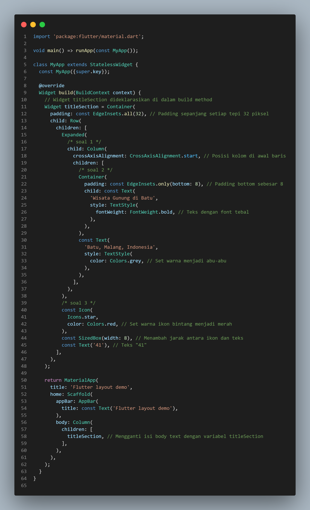

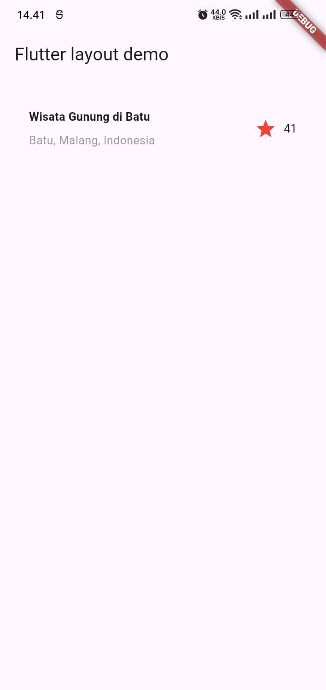

# **Praktikum 2: Implementasi button row**
## **Langkah 1: Buat method Column _buildButtonColumn**
Bagian tombol berisi 3 kolom yang menggunakan tata letak yang sama—sebuah ikon di atas baris teks. Kolom pada baris ini diberi jarak yang sama, dan teks serta ikon diberi warna primer.

Karena kode untuk membangun setiap kolom hampir sama, buatlah metode pembantu pribadi bernama buildButtonColumn(), yang mempunyai parameter warna, Icon dan Text, sehingga dapat mengembalikan kolom dengan widgetnya sesuai dengan warna tertentu.
lib/main.dart (_buildButtonColumn)
 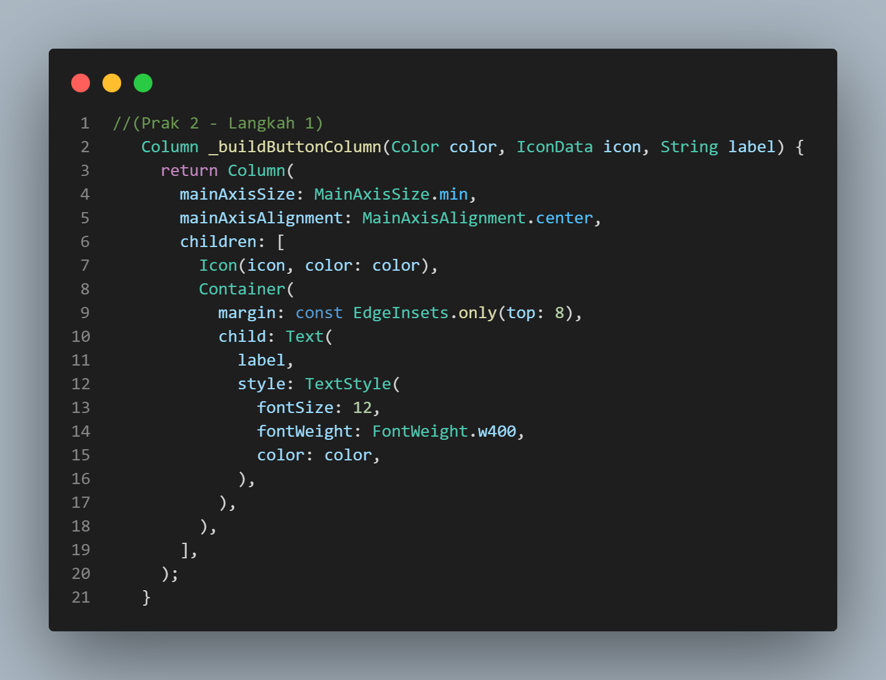

## **Langkah 2: Buat widget buttonSection**
Buat Fungsi untuk menambahkan ikon langsung ke kolom. Teks berada di dalam Container dengan margin hanya di bagian atas, yang memisahkan teks dari ikon.

Bangun baris yang berisi kolom-kolom ini dengan memanggil fungsi dan set warna, Icon, dan teks khusus melalui parameter ke kolom tersebut. Sejajarkan kolom di sepanjang sumbu utama menggunakan MainAxisAlignment.spaceEvenly untuk mengatur ruang kosong secara merata sebelum, di antara, dan setelah setiap kolom. Tambahkan kode berikut tepat di bawah deklarasi titleSection di dalam metode build():

lib/main.dart (buttonSection)
 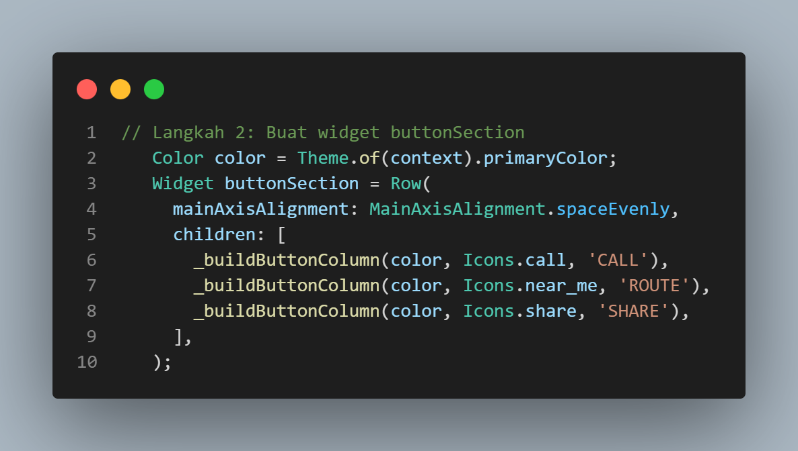

## **Langkah 3: Tambah button section ke body**
Tambahkan variabel buttonSection ke dalam body seperti berikut:

 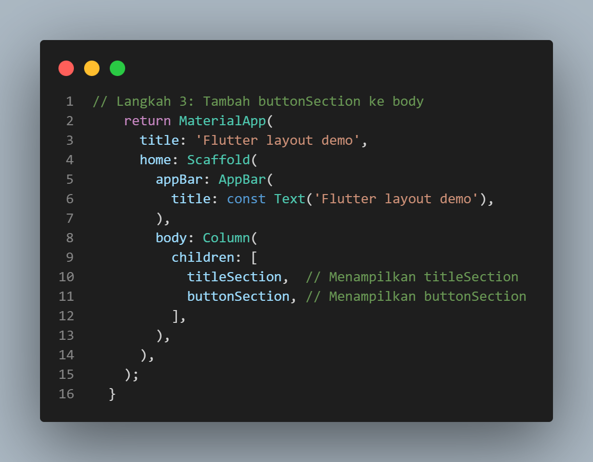

 Hasilnya di Handphone
  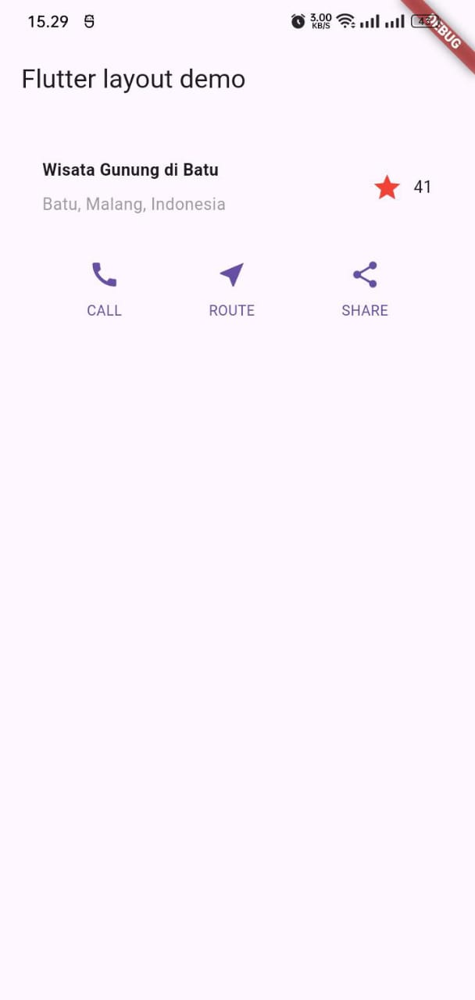

# **Praktikum 3: Implementasi text section**
## **Langkah 1: Buat widget textSection**
Tentukan bagian teks sebagai variabel. Masukkan teks ke dalam Container dan tambahkan padding di sepanjang setiap tepinya. Tambahkan kode berikut tepat di bawah deklarasi buttonSection:
Dengan memberi nilai softWrap = true, baris teks akan memenuhi lebar kolom sebelum membungkusnya pada batas kata.

 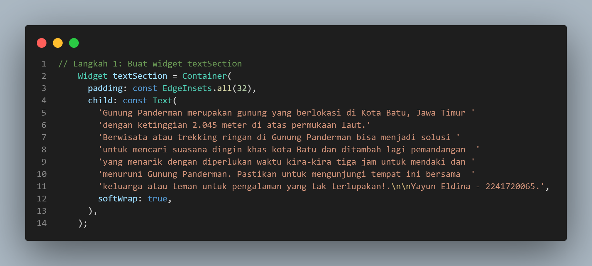

## **Langkah 2: Tambahkan variabel text section ke body**
Tambahkan widget variabel textSection ke dalam body seperti berikut:

 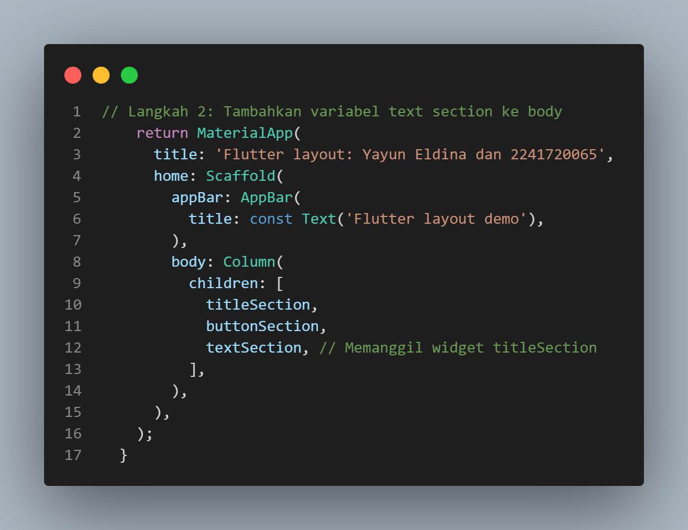

 Hasilnya:

  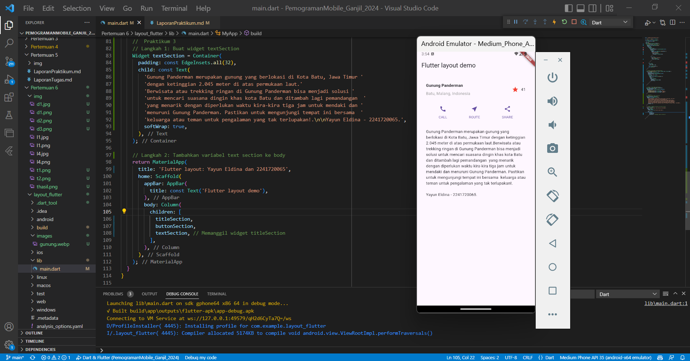

# **Praktikum 4: Implementasi image section**
## **Langkah 1: Siapkan aset gambar**
Anda dapat mencari gambar di internet yang ingin ditampilkan. Buatlah folder images di root project layout_flutter. Masukkan file gambar tersebut ke folder images, lalu set nama file tersebut ke file pubspec.yaml seperti berikut:
ontoh nama file gambar di atas adalah lake.jpg

 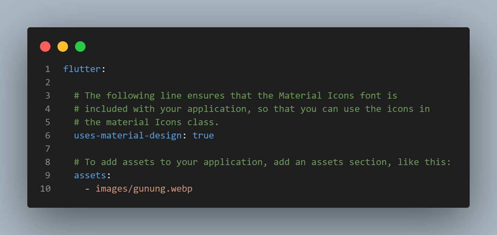

## **Langkah 2: Tambahkan gambar ke body**
Tambahkan aset gambar ke dalam body seperti berikut:
BoxFit.cover memberi tahu kerangka kerja bahwa gambar harus sekecil mungkin tetapi menutupi seluruh kotak rendernya.

 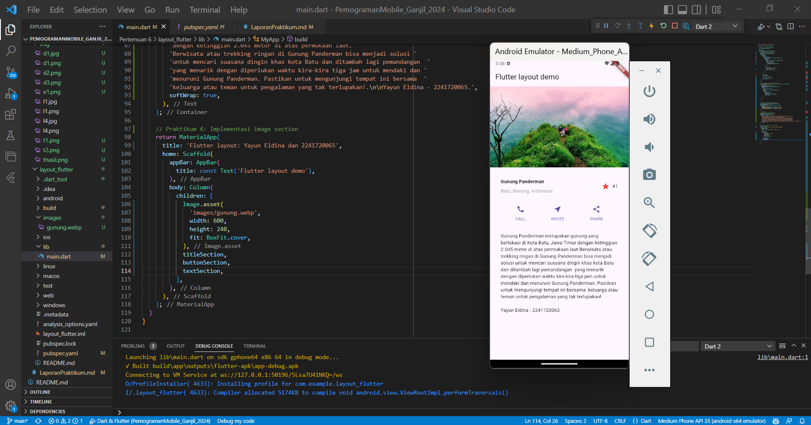

## **Langkah 3: Terakhir, ubah menjadi ListView**
Pada langkah terakhir ini, atur semua elemen dalam ListView, bukan Column, karena ListView mendukung scroll yang dinamis saat aplikasi dijalankan pada perangkat yang resolusinya lebih kecil.

 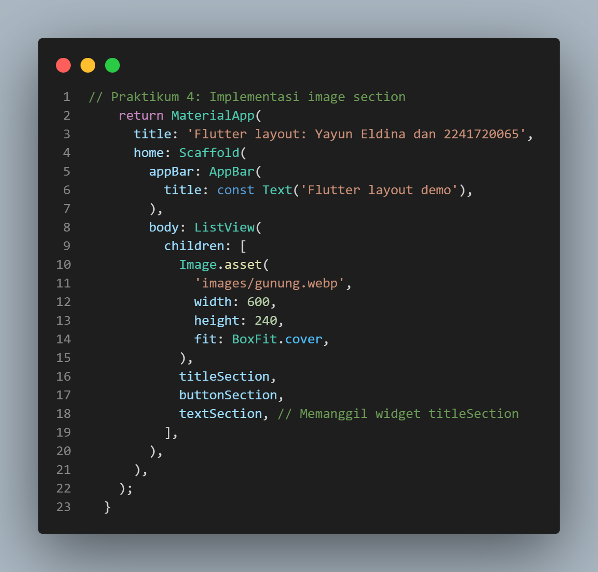

# **Praktikum 5: Membangun Navigasi di Flutter**
## **Langkah 1: Siapkan Project Baru**
Membuat project baru dengan nama belanja

 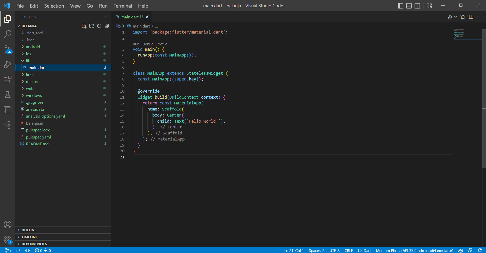

Menyiapkan struktur folder.

  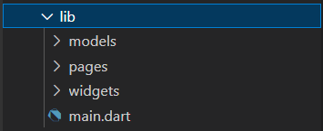

## **Langkah 2: Mendefinisikan Route**
Membuat dua buah file dart dengan nama home_page.dart dan item_page.dart pada folder pages. Untuk masing-masing file,dideklarasikan class HomePage pada file home_page.dart dan ItemPage pada item_page.dart. Turunkan class dari StatelessWidget.

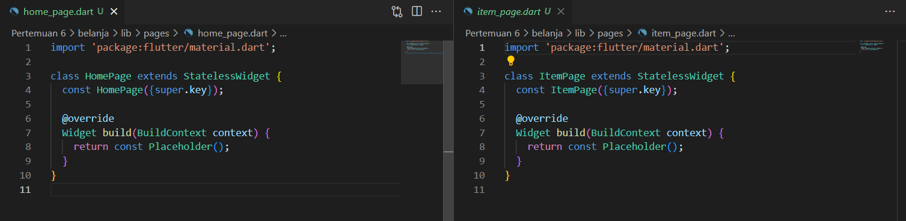

## **Langkah 3: Lengkapi Kode di main.dart**
Setelah kedua halaman telah dibuat dan didefinisikan, file main.dart definisikan Route untuk kedua halaman tersebut. Definisi penamaan route harus bersifat unique. Halaman HomePage didefinisikan sebagai /. Dan halaman ItemPage didefinisikan sebagai /item. Untuk mendefinisikan halaman awal, dapat menggunakan named argument initialRoute.

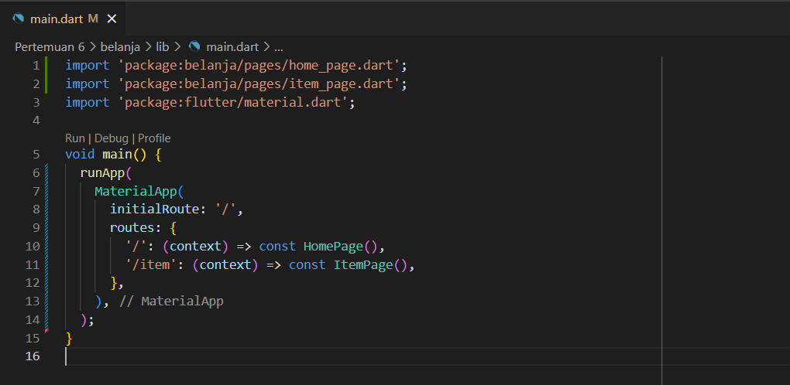

## **Langkah 4: Membuat data model**
Sebelum melakukan perpindahan halaman dari HomePage ke ItemPage, dibutuhkan proses pemodelan data. Pada desain mockup, dibutuhkan dua informasi yaitu nama dan harga. Untuk menangani hal ini, buatlah sebuah file dengan nama item.dart dan letakkan pada folder models.

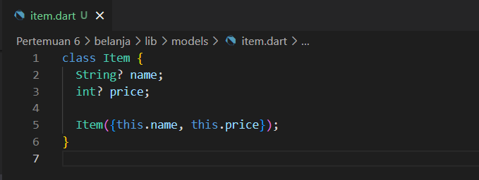

## **Langkah 5: Lengkapi kode di class HomePage**
Pada halaman HomePage terdapat ListView widget. Sumber data ListView diambil dari model List dari object Item.

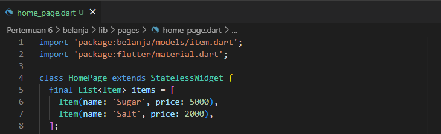

## **Langkah 6: Membuat ListView dan itemBuilder**
Untuk menampilkan ListView pada praktikum ini digunakan itemBuilder. Data diambil dari definisi model yang telah dibuat sebelumnya.

Kode beserta hasil running.
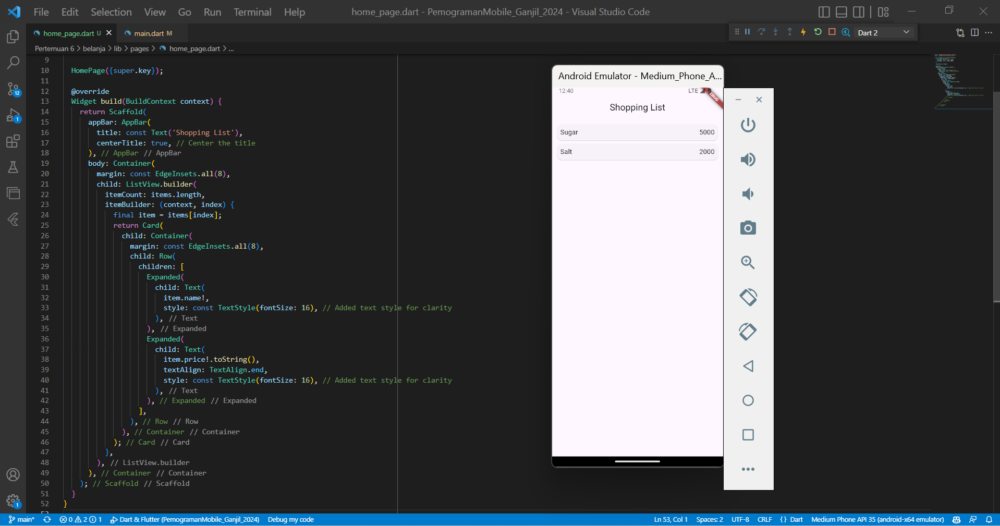

## **Langkah 7: Menambahkan aksi pada ListView**
Untuk menambahkan aksi pada ListView dapat digunakan widget InkWell atau GestureDetector. Perbedaan utamanya InkWell merupakan material widget yang memberikan efek ketika ditekan. Sedangkan GestureDetector bersifat umum dan bisa juga digunakan untuk gesture lain selain sentuhan.

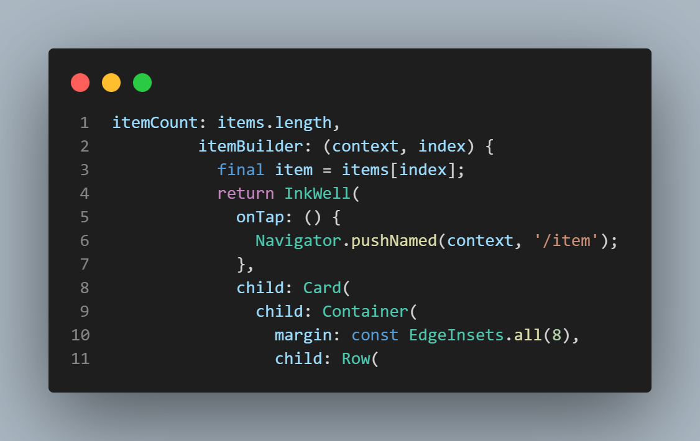

Sekarang jika item pada ListView ditekan, maka akan berpindah ke halaman ItemPage.

<!DOCTYPE html>
<html lang="en">
<head>
    <meta charset="UTF-8">
    <meta name="viewport" content="width=device-width, initial-scale=1.0">
    <title>Video Example</title>
</head>
<body>
    <video width="800" height="400" autoplay muted loop>
        <source src="img/p5.l7.mp4" type="video/mp4">
        Your browser does not support the video tag.
    </video>
</body>
</html>

