# **JOBSHEET 6**

## Nama     : Yayun Eldina
## NIM      : 2241720065
## Kelas    : Teknik Informatika - 3F

## **Tugas Praktikum 2**
1. Untuk melakukan pengiriman data ke halaman berikutnya, cukup menambahkan informasi arguments pada penggunaan Navigator. Perbarui kode pada bagian Navigator menjadi seperti berikut.

'''
    Navigator.pushNamed(context, ItemPage.routeName, arguments: item);
'''

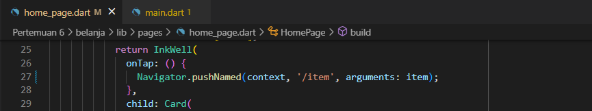

2. Pembacaan nilai yang dikirimkan pada halaman sebelumnya dapat dilakukan menggunakan ModalRoute. Tambahkan kode berikut pada blok fungsi build dalam halaman ItemPage. Setelah nilai didapatkan, anda dapat menggunakannya seperti penggunaan variabel pada umumnya.

'''
    final itemArgs = ModalRoute.of(context)!.settings.arguments as Item;
'''

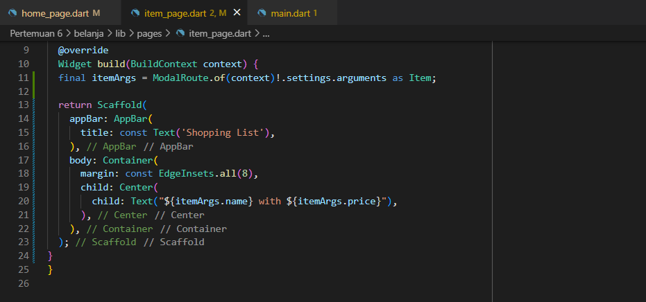

Jika berhasil, maka akan muncul data yang dikirimkan pada halaman sebelumnya.

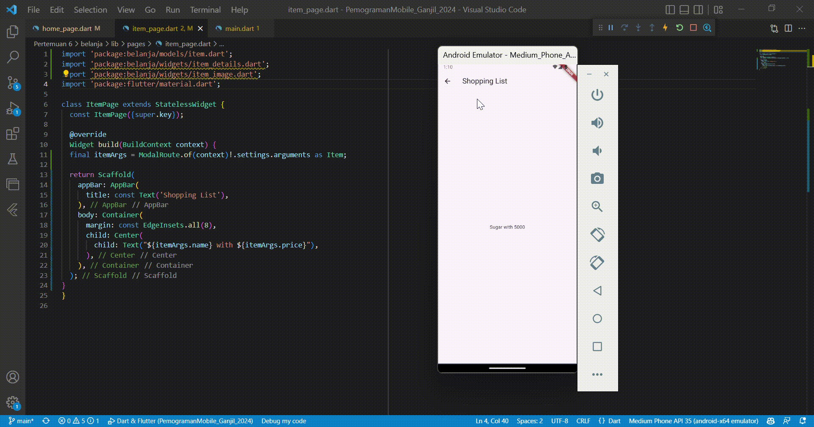

3. Pada hasil akhir dari aplikasi belanja yang telah anda selesaikan, tambahkan atribut foto produk, stok, dan rating. Ubahlah tampilan menjadi GridView seperti di aplikasi marketplace pada umumnya.

Menambahkan atribut foto produk, stok, dan rating pada model Item.

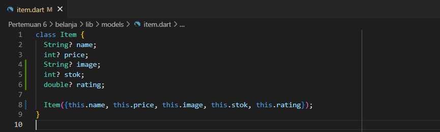

Menambahkan foto, stok, dan rating pada list item.

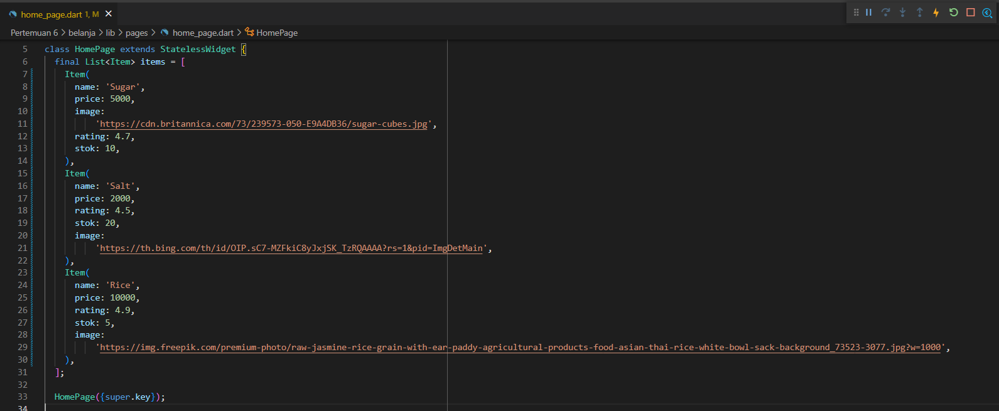

Mengubah tampilan menjadi GridView.

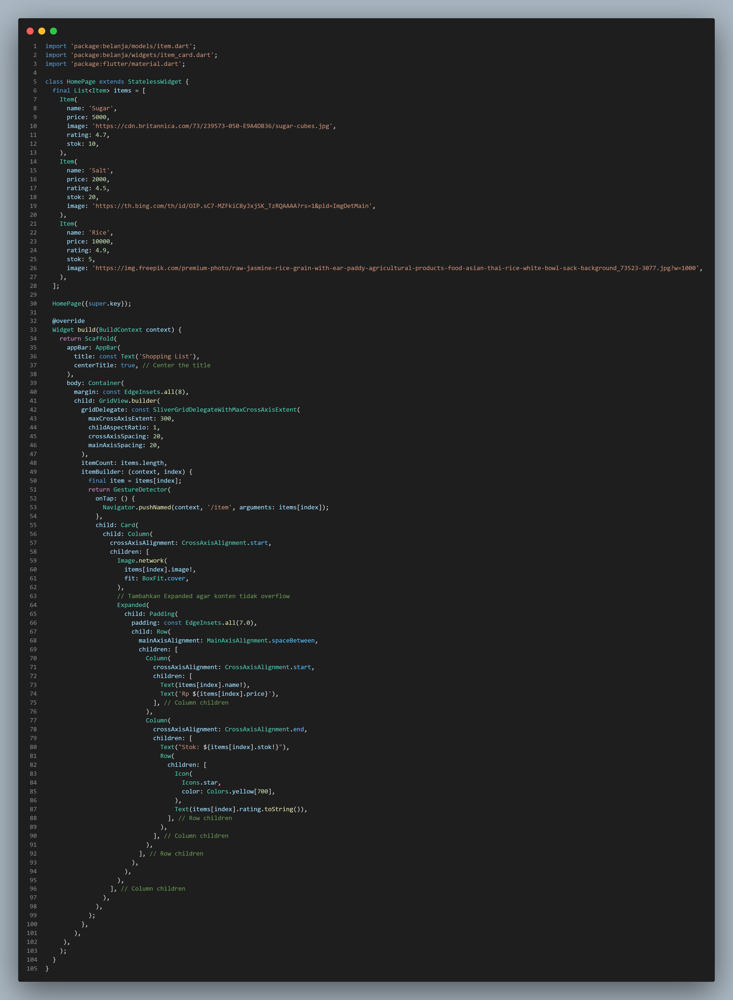

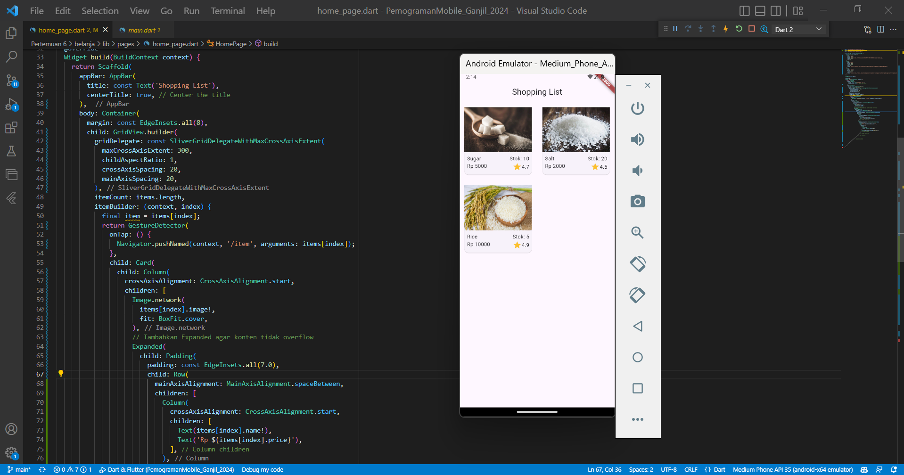

4. Silakan implementasikan Hero widget pada aplikasi belanja Anda.

Menambahkan Hero widget pada item list di HomePage.

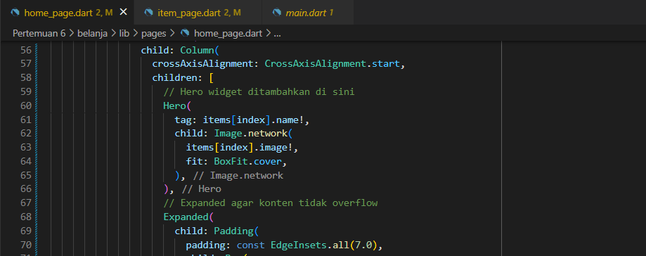

Menambahkan Hero widget pada ItemPage.

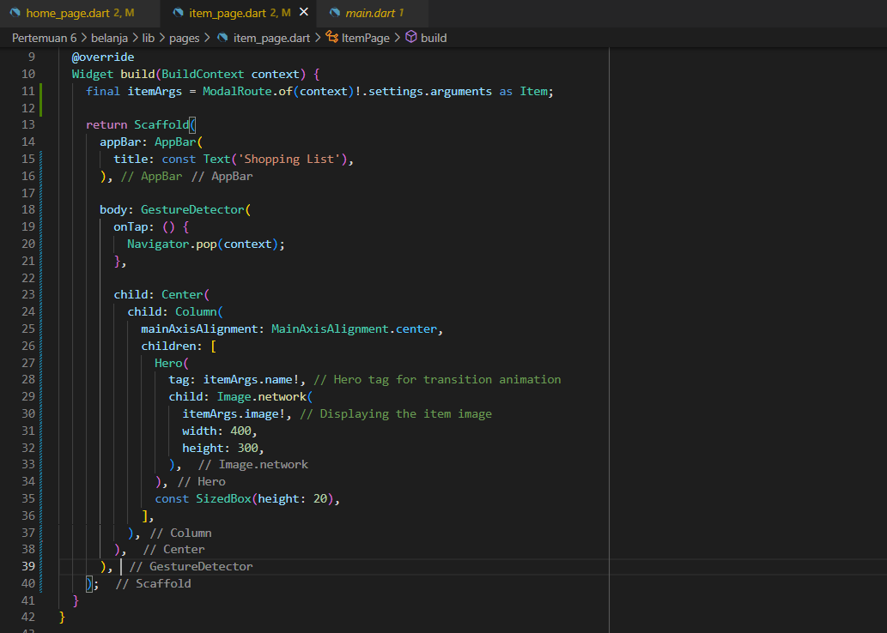

Jika berhasil, maka akan muncul animasi Hero widget.

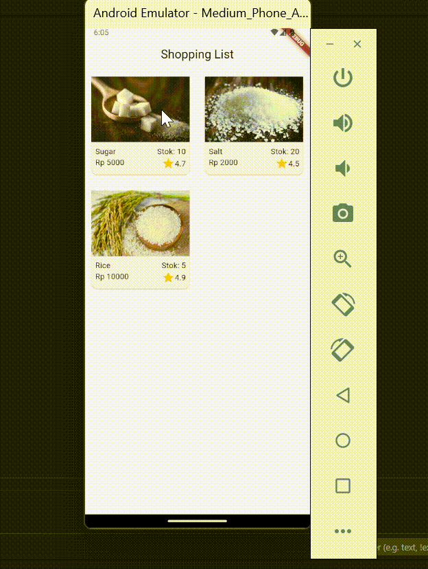

5. Sesuaikan dan modifikasi tampilan sehingga menjadi aplikasi yang menarik. Selain itu, pecah widget menjadi kode yang lebih kecil. Tambahkan Nama dan NIM di footer aplikasi belanja Anda.

Memecah widget menjadi 3 component, yaitu ItemImage,ItemCard, dan ItemDetails.

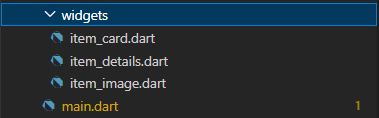

Berikut detail kode:

Ubah home_page.dart menjadi seperti berikut:

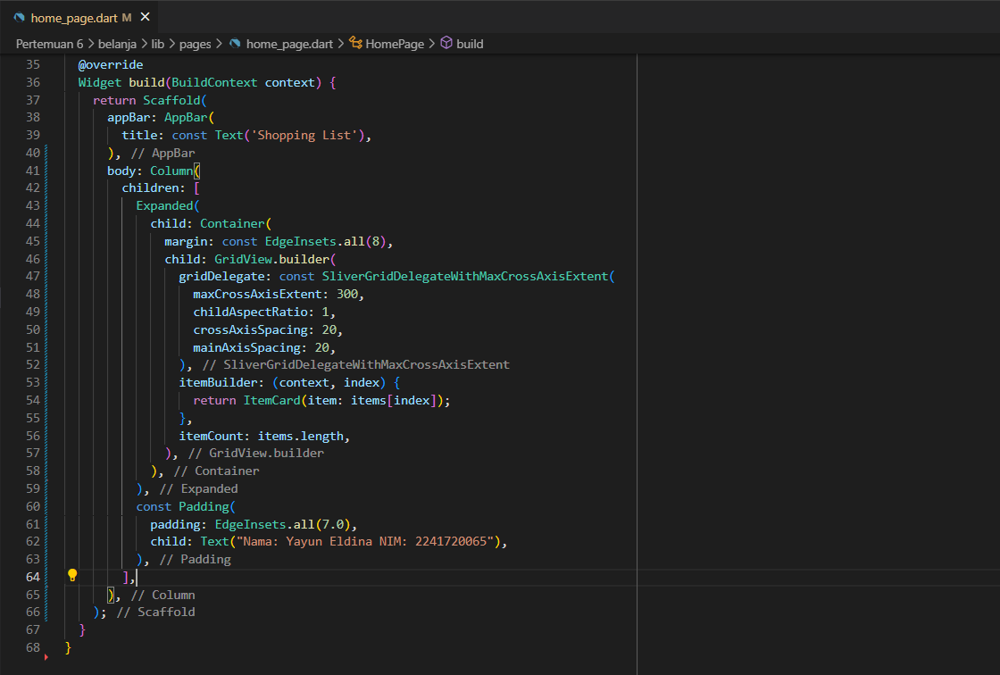

Ubah item_page.dart menjadi seperti berikut:

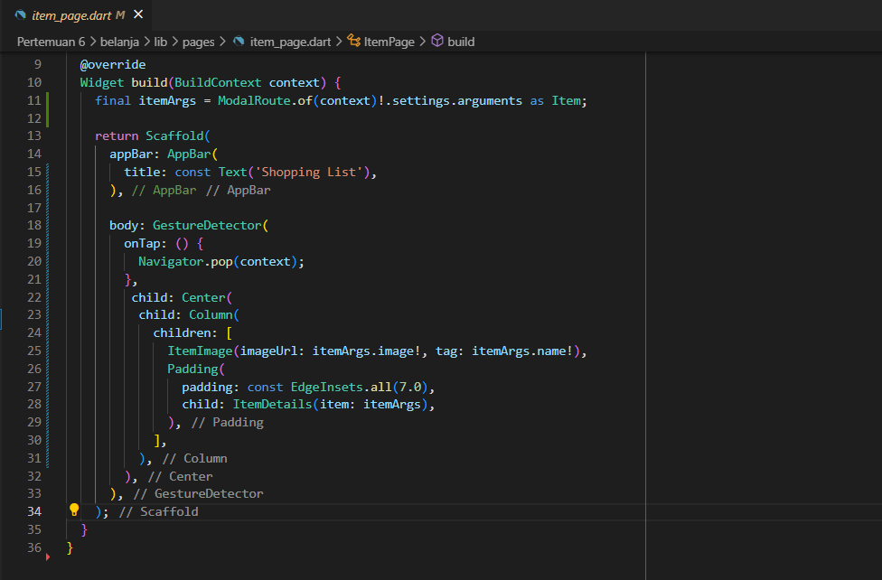

Hasil:

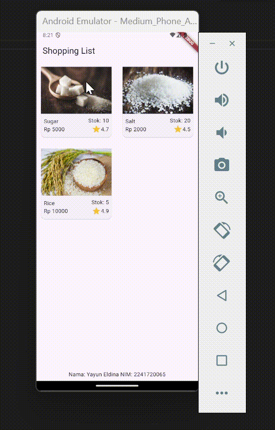

6. Selesaikan Praktikum 5: Navigasi dan Rute tersebut. Cobalah modifikasi menggunakan plugin go_router.

Menambahkan go_router pada pubspec.yaml.

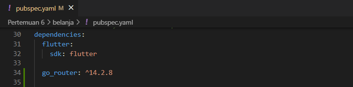

Konfigurasi go_router di file main.dart.

Menggunakan go_router pada ItemCard.

Menerapkan go_router pada ItemPage.

Menjalankan "Futter pub get"

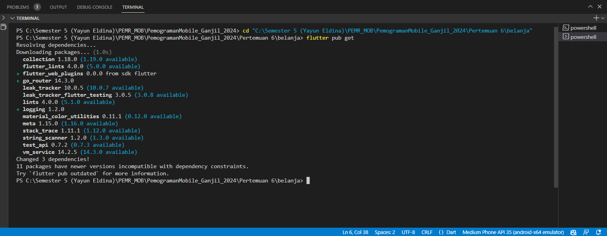

Hasil:

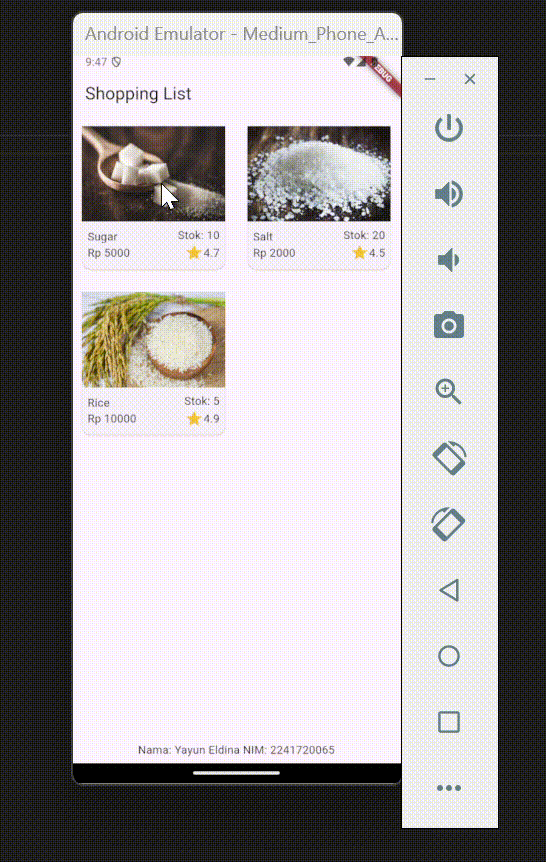
