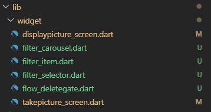
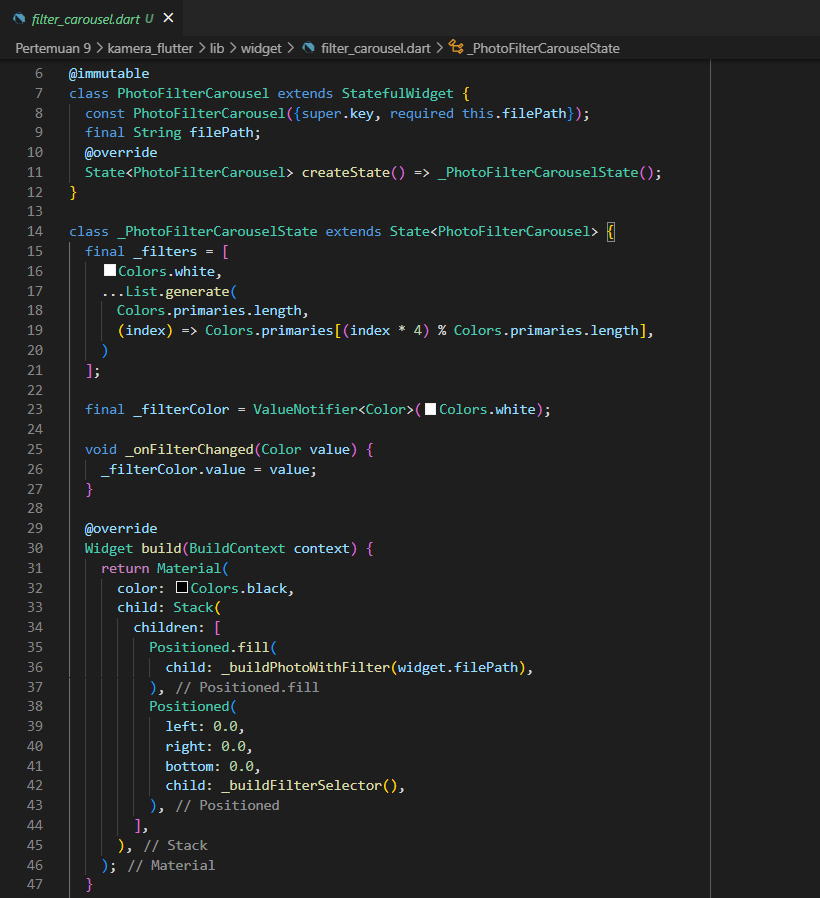
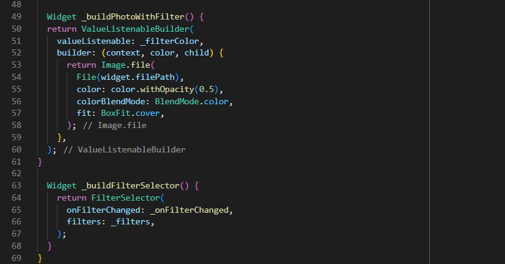
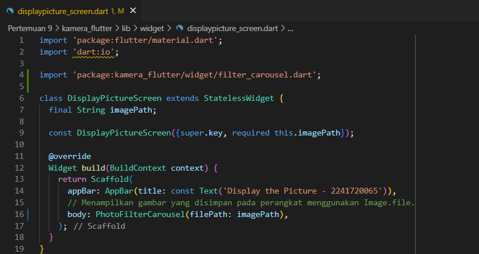

<table>
    <thead>
        <th style="text-align: center;" colspan="2">Pertemuan 9</th>
    </thead>
    <tbody>
        <tr>
            <td>Nama</td>
            <td>Yayun Eldina</td>
        </tr>
        <tr>
            <td>Nim</td>
            <td>2241720065</td>
        </tr>
    </tbody>
</table>

**********
# *Jobsheet 09 - Kamera di Flutter*
***********

## Tugas

-----

#### **Gabungkan hasil praktikum 1 dengan hasil praktikum 2 sehingga setelah melakukan pengambilan foto, dapat dibuat filter carouselnya!**
Memasukkan file hasil praktikum 2 ke dalam praktikum 1

Menambahkan parameter imagePath pada PhotoFilterCarousel

Menambahkan PhotoFilterCarousel pada DisplayPictureScreen

Hasilnya:

#### **Jelaskan maksud void async pada praktikum 1?**
*void async* digunakan untuk membuat fungsi menjadi asynchronous dimana fungsi tersebut dapat dieksekusi secara bersamaan dengan fungsi lainnya. Dengan demikian, fungsi ini tidak perlu menunggu penyelesaian proses yang sedang berlangsung untuk melanjutkan eksekusi.

#### **Jelaskan fungsi dari anotasi @immutable dan @override?**
*@immutable* digunakan untuk menunjukkan bahwa objek yang dianotasikan memiliki properti yang tidak akan berubah setelah objek dibuat. Ini memastikan semua properti harus diinisialisasi dalam konstruktor dan tidak dapat diubah setelahnya.

*@override* digunakan untuk menanda metode atau properti yang dioverride dari superclass atau interface. Ini membantu compiler memeriksa kesesuaian pada metode dioverride, sehingga dapat mengidentifikasi kesalahan penulisan.